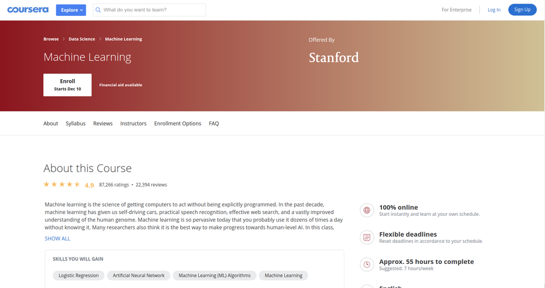

# Lesson 3 - Multi-label, Segmentation, Image Regression, and More

_These are my personal notes from fast.ai Live (the new International Fellowship programme) course and will continue to be updated and improved if I find anything useful and relevant while I continue to review the course to study much more in-depth. Thanks for reading and happy learning!_

Live date: 9 Nov 2018, GMT+8

## Topics

* Multi-label classification
* Kaggle Planet Amazon dataset of satellite images
* fastai Data Block API
* fastai DataBunch class
* Image segmentation with CamVid
* U-Net
* Learning rate annealing
* Mixed precision training
* Image regression with BIWI head pose dataset
* NLP classification
* Universal approximation theorem

## Lesson Resources

* [Course website](https://course.fast.ai/)
* [Lesson 3 video player](https://course.fast.ai/videos/?lesson=3)
* [Video](https://www.youtube.com/watch?v=MpZxV6DVsmM)
* [Official resources and updates (Wiki)](https://forums.fast.ai/t/lesson-3-official-resources-and-updates/29732)
* [Forum discussion](https://forums.fast.ai/t/lesson-3-chat/29733)
* [Advanced forum discussion](https://forums.fast.ai/t/lesson-3-advanced-discussion/29750)
* [FAQ, resources, and official course updates](https://forums.fast.ai/t/faq-resources-and-official-course-updates/27934)
* Jupyter Notebook and code
  * [lesson3-planet.ipynb](https://nbviewer.jupyter.org/github/fastai/course-v3/blob/master/nbs/dl1/lesson3-planet.ipynb)
  * [lesson3-camvid.ipynb](https://nbviewer.jupyter.org/github/fastai/course-v3/blob/master/nbs/dl1/lesson3-camvid.ipynb)
  * [lesson3-head-pose.ipynb](https://nbviewer.jupyter.org/github/fastai/course-v3/blob/master/nbs/dl1/lesson3-head-pose.ipynb)
  * [lesson3-imdb.ipynb](https://nbviewer.jupyter.org/github/fastai/course-v3/blob/master/nbs/dl1/lesson3-imdb.ipynb)

## Assignments

* Run lesson 3 notebooks.
* Replicate lesson 3 notebooks with your own dataset.
* Dig into the Data Block API.

## Other Resources

### Blog Posts and Articles

* [Universal Language Model Fine-tuning (ULMFiT) for Text Classification](http://nlp.fast.ai/category/classification.html) used in [`language_model_learner`](https://docs.fast.ai/text.html)
* [Michael Nielsen's book](http://neuralnetworksanddeeplearning.com/)
* Quick and easy model deployment on Zeit Now guide
* [Data Block API](https://docs.fast.ai/data_block.html)

### Other Useful Information

* Useful online courses for machine learning background:
  * [Machine Learning](https://www.coursera.org/learn/machine-learning) taught by Andrew Ng (Coursera)
  * [Introduction to Machine Learning for Coders](https://course.fast.ai/ml) taught by Jeremy Howard
* [Python partials](https://docs.python.org/3/library/functools.html#functools.partial)
* Nov 14 Meetup - [Conversation between Jeremy Howard and Leslie Smith](https://www.meetup.com/sfmachinelearning/events/255566613/)
* [List of vision transforms](https://docs.fast.ai/vision.transform.html#List-of-transforms)

### Useful Tools and Libraries

* Fast.ai Video Viewer with searchable transcript
* [MoviePy](https://zulko.github.io/moviepy) Python module for video editing mentioned by Rachel
* [WebRTC example for web video](https://github.com/etown/dl1/blob/master/face/static/index.html) from Ethan Sutin

### Papers

* Optional reading
  * [Cyclical Learning Rates for Training Neural Networks by Leslie Smith](https://arxiv.org/abs/1506.01186)

# My Notes

A quick correction on citation.

This chart originally cane from Andrew Ng's excellent machine learning course on Coursera. Apologies for the incorrect citation.

**Machine Learning course**

[Andrew Ng's machine learning course](https://www.coursera.org/learn/machine-learning) on Coursera is great. In some ways, it's a little dated but a lot of the content is as appropriate as ever and taught in a bottom-up style. So it can be quite nice to combine it with our top down style and meet somewhere in the middle.

Also, if you are interested in machine learning foundations, you should check out our [machine learning course](https://course.fast.ai/ml) as well. It is about twice as long as this deep learning course and takes you much more gradually through some of the foundational stuff around validation sets, model interpretation, how PyTorch tensor works, etc. I think all these courses together, if you really dig deeply into the material, do all of them. I know a lot of people who have and end up saying "oh, I got more out of each one by doing a whole lot". Or you can backwards and forwards to see which one works for you.

## Deploy web app with your model in production

We started talking about deploying your web app last week. One thing that's going to make life a lot easier for you is that https://course-v3.fast.ai/ has a production section where right now we have one platform but more will be added showing you how to deploy your web app really easily. When I say easily, for example, here is [how to deploy on Zeit guide](https://course-v3.fast.ai/deployment_zeit.html) created by San Francisco study group member, Navjot.

As you can see, it's just a page. There's almost nothing to and it's free. It's not going to serve 10,000 simultaneous requests but it'll certainly get you started and I found it works really well. It's fast. Deploying a model doesn't have to be slow or complicated anymore. And the nice thing is, you can use this for a Minimum Viable Product (MVP) if you do find it's starting to get a thousand simultaneous requests, then you know that things are working out and you can start to upgrade your instance types or add to a more traditional big engineering approach. If you actually use this starter kit, it will create my teddy bear finder for you. So the idea is, this template is as simple as possible. So you can fill in your own style sheets, your own custom logic, and so forth. This is designed to be a minimal thing, so you can see exactly what's going on. The backend is a simple REST style interface that sends back JSON and the frontend is a super simple little JavaScript thing. It should be a good way to get a sense of how to build a web app which talks to a PyTorch model.
