# Lesson 9 - Multi-object Detection

_These are my personal notes from fast.ai course and will continue to be updated and improved if I find anything useful and relevant while I continue to review the course to study much more in-depth. Thanks for reading and happy learning!_

## Topics

* Move from single object to multi-object detection.
* **Main focus** is on the single shot multibox detector \(SSD\).
  * Multi-object detection by using a loss function that can combine losses from multiple objects, across both localization and classification.
  * Custom architecture that takes advantage of the difference receptive fields of different layers of a CNN.
* YOLO v3
* Simple but powerful trick called focal loss.

## Lesson Resources

* [Website](http://course.fast.ai/lessons/lesson9.html)
* [Video](https://youtu.be/0frKXR-2PBY)
* [Wiki](http://forums.fast.ai/t/part-2-lesson-9-wiki)
* [Forum discussion](http://forums.fast.ai/t/part-2-lesson-9-in-class/14028/1)
* Jupyter Notebook and code
  * [pascal.ipynb](https://nbviewer.jupyter.org/github/fastai/fastai/blob/master/courses/dl2/pascal.ipynb)
  * [pascal-multi.ipynb](https://nbviewer.jupyter.org/github/fastai/fastai/blob/master/courses/dl2/pascal-multi.ipynb)

## Assignments

### Papers

* Must read
  * [SSD: Single Shot MultiBox Detector](https://arxiv.org/abs/1512.02325)
  * [Scalable Object Detection using Deep Neural Networks](https://arxiv.org/abs/1312.2249)
  * [Faster R-CNN: Towards Real-Time Object Detection with Region Proposal Networks](https://arxiv.org/abs/1506.01497)
  * [You Only Look Once \(YOLO\): Unified, Real-Time Object Detection](https://arxiv.org/abs/1506.02640)
  * [Focal Loss for Dense Object Detection](https://arxiv.org/abs/1708.02002) \(RetinaNet\)
  * [YOLO version 3](https://pjreddie.com/media/files/papers/YOLOv3.pdf)
* Additional papers \(optional\)
  * [Understanding the Effective Receptive Field in Deep Convolutional Neural Networks](https://arxiv.org/abs/1701.04128)

### Other Resources

#### Blog Posts and Articles

* Optional reading
  * [Understanding SSD MultiBox — Real-Time Object Detection In Deep Learning](https://towardsdatascience.com/understanding-ssd-multibox-real-time-object-detection-in-deep-learning-495ef744fab)
  * [Deep Learning for Object Detection: A Comprehensive Review](https://towardsdatascience.com/deep-learning-for-object-detection-a-comprehensive-review-73930816d8d9)
  * [The effective receptive field on CNNs](http://blog.christianperone.com/2017/11/the-effective-receptive-field-on-cnns/)
  * [The Modern History of Object Recognition — Infographic](https://medium.com/@nikasa1889/the-modern-history-of-object-recognition-infographic-aea18517c318)

#### Other Useful Information

* [Understanding Anchors](https://docs.google.com/spreadsheets/d/1ci7KMggF-_4kv8zRTE0B_u7z-mbrKEzgvqXXKy4-KYQ/edit#gid=0) by fast.ai's fellow, Hiromi Suenaga
* [A guide to receptive field arithmetic for CNNs](https://medium.com/mlreview/a-guide-to-receptive-field-arithmetic-for-convolutional-neural-networks-e0f514068807)
* [Convolution arithmetic tutorial](http://deeplearning.net/software/theano/tutorial/conv_arithmetic.html)
* Stanford CS231n videos:
  * [Summer 2016, Lesson 8 - Localization and Detection](https://youtu.be/GxZrEKZfW2o)
  * [Winter 2017, Lesson 11 - Detection and Segmentation](https://youtu.be/nDPWywWRIRo)
* Coursera's deeplearning.ai course videos:
  * [Object Detection](https://www.youtube.com/watch?v=UBTRCUJEZww&index=25&list=PLBAGcD3siRDjBU8sKRk0zX9pMz9qeVxud)
  * [Bounding Box Predictions](https://www.youtube.com/watch?v=DFjHkXhkYzA&index=27&list=PLBAGcD3siRDjBU8sKRk0zX9pMz9qeVxud)
  * [Intersection Over Union](https://www.youtube.com/watch?v=DNEm4fJ-rto&index=28&list=PLBAGcD3siRDjBU8sKRk0zX9pMz9qeVxud)
  * [Non-Max Suppression (NMS)](https://www.youtube.com/watch?v=A46HZGR5fMw&index=29&list=PLBAGcD3siRDjBU8sKRk0zX9pMz9qeVxud)
  * [Anchor Boxes](https://www.youtube.com/watch?v=Pf7iFeRPYK8&index=30&list=PLBAGcD3siRDjBU8sKRk0zX9pMz9qeVxudd)
  * [YOLO Algorithm](https://www.youtube.com/watch?v=YQYtgzOf9g4&index=31&list=PLBAGcD3siRDjBU8sKRk0zX9pMz9qeVxud)
* Other videos:
  * [YOLO CVPR 2016 talk](https://youtu.be/NM6lrxy0bxs) -- the idea of using grid cells and treating detection as a regression problem is focused on in more detail.
  * [YOLOv2 talk](https://www.youtube.com/watch?v=GBu2jofRJtk&t=4s) -- there is some good information in this talk, although some drawn explanations are omitted from the video. What I found interesting was the bit on learning anchor boxes from the dataset. There's also the crossover with NLP at the end.
  * [Focal Loss ICCV17 talk](https://youtu.be/44tlnmmt3h0)

#### Frequently Sought Pieces of Information in the Wiki Thread

* [Visualization of SSD_MultiHead](http://forums.fast.ai/t/part-2-lesson-9-in-class/14028/375) by Chloe Sultan (@chloews)
* [Why in the `BCE_Loss` we add a column for the background (bg) class and then chop it off?](http://forums.fast.ai/t/part-2-lesson-9-in-class/14028/363)

### Useful Tools and Libraries

* [Receptive Field Calculator](http://fomoro.com/tools/receptive-fields/)

## My Notes

### Review

You should understand this by now:

- Pathlib; JSON
- Dictionary comprehensions
- `defaultdict`
- How to jump around fastai source
- matplotlib Object Oriented API
- Lambda functions
- Bounding box coordinates
- Custom head; bounding box regression

#### Data Augmentation and Bounding Box

[pascal.ipynb](https://nbviewer.jupyter.org/github/fastai/fastai/blob/master/courses/dl2/pascal.ipynb)

A classifier is anything with dependent variable is categorical or binomial. As opposed to regression which is anything with dependent variable is continuous. Naming is a little confusing but will be sorted out in future. Here, `continuous` is `True` because our dependent variable is the coordinates of bounding box — hence this is actually a regressor data.

```Python
tfms = tfms_from_model(f_model, sz, crop_type=CropType.NO, aug_tfms=augs)
md = ImageClassifierData.from_csv(PATH, JPEGS, BB_CSV, tfms=tfms, continuous=True, bs=4)
```

##### Data Augmentation

```Python
augs = [RandomFlip(),
        RandomRotate(30),
        RandomLighting(0.1,0.1)]
```

```Python
tfms = tfms_from_model(f_model, sz, crop_type=CropType.NO, aug_tfms=augs)
md = ImageClassifierData.from_csv(PATH, JPEGS, BB_CSV, tfms=tfms, continuous=True, bs=4)

idx = 3
fig, axes = plt.subplots(3, 3, figsize=(9, 9))

for i, ax in enumerate(axes.flat):
    x, y = next(iter(md.aug_dl))
    ima = md.val_ds.denorm(to_np(x))[idx]
    b = bb_hw(to_np(y[idx]))
    print('b:', b)
    show_img(ima, ax=ax)
    draw_rect(ax, b)
```

```Python
b: [  1.  89. 499. 192.]
b: [  1.  89. 499. 192.]
b: [  1.  89. 499. 192.]
b: [  1.  89. 499. 192.]
b: [  1.  89. 499. 192.]
b: [  1.  89. 499. 192.]
b: [  1.  89. 499. 192.]
b: [  1.  89. 499. 192.]
b: [  1.  89. 499. 192.]
```


As you can see, the image gets rotated and lighting varies, but bounding box is not moving and is in a wrong spot [00:06:17]. This is the problem with data augmentations when your dependent variable is pixel values or in some way connected to the independent variable — they need to be augmented together.

The dependent variable needs to go through all the geometric transformation as the independent variables.

To do this [00:07:10], every transformation has an optional `tfm_y` parameter:

```Python
augs = [RandomFlip(tfm_y=TfmType.COORD),
        RandomRotate(30, tfm_y=TfmType.COORD),
        RandomLighting(0.1,0.1, tfm_y=TfmType.COORD)]

tfms = tfms_from_model(f_model, sz, crop_type=CropType.NO, aug_tfms=augs, tfm_y=TfmType.COORD)
md = ImageClassifierData.from_csv(PATH, JPEGS, BB_CSV, tfms=tfms, continuous=True, bs=4)
```

`TrmType.COORD` indicates that the `y` value represents coordinate. This needs to be added to all the augmentations as well as `tfms_from_model` which is responsible for cropping, zooming, resizing, padding, etc.

```Python
idx = 3
fig, axes = plt.subplots(3, 3, figsize=(9, 9))

for i, ax in enumerate(axes.flat):
    x, y = next(iter(md.aug_dl))
    ima = md.val_ds.denorm(to_np(x))[idx]
    b = bb_hw(to_np(y[idx]))
    print(b)
    show_img(ima, ax=ax)
    draw_rect(ax, b)
```

```Python
[  1.  60. 221. 125.]
[  0.  12. 224. 211.]
[  0.   9. 224. 214.]
[  0.  21. 224. 202.]
[  0.   0. 224. 223.]
[  0.  55. 224. 135.]
[  0.  15. 224. 208.]
[  0.  31. 224. 182.]
[  0.  53. 224. 139.]
```

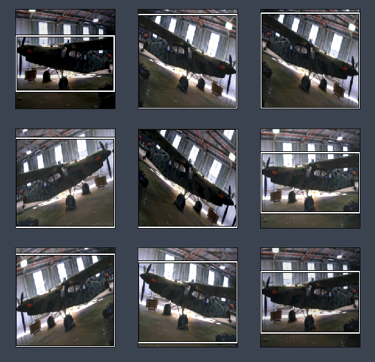

##### `custom_head`

`learn.summary()` will run a small batch of data through a model and prints out the size of tensors at every layer. As you can see, right before the `Flatten` layer, the tensor has the shape of 512 by 7 by 7. So if it were a rank 1 tensor (i.e. a single vector) its length will be 25088 (512 * 7 * 7)and that is why our custom header's input size is 25088. Output size is 4 since it is the bounding box coordinates.

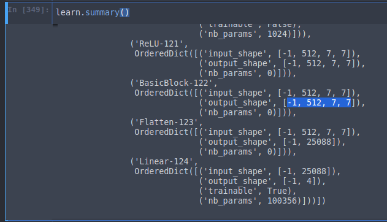

### Single Object Detection

We combine the two to create something that can classify and localize the largest object in each image.

There are 3 things that we need to do to train a neural network:

1. Data
2. Architecture
3. Loss function

#### 1. Data

We need a `ModelData` object whose independent variable is the images, and dependent variable is a tuple of bounding box coordinates and class label.

There are several ways to do this, but here's a particularly 'lazy' and convenient way that is to create two `ModelData` objects representing the two different dependent variables we want:
1. bounding boxes coordinates
2. class

```Python
f_model=resnet34
sz=224
bs=64

# Split dataset for validation set
val_idxs = get_cv_idxs(len(trn_fns))

tfms = tfms_from_model(f_model, sz, crop_type=CropType.NO, tfm_y=TfmType.COORD, aug_tfms=augs)
```

`ModelData` for bounding box of the largest object:

```Python
md = ImageClassifierData.from_csv(PATH, JPEGS, BB_CSV, tfms=tfms,
                                  bs=bs, continuous=True, val_idxs=val_idxs)
```

`ModelData` for classification of the largest object:

```Python
md2 = ImageClassifierData.from_csv(PATH, JPEGS, CSV, tfms=tfms_from_model(f_model, sz))
```

Let's break that down a bit.

```Python
CSV_FILES = PATH / 'tmp'

!ls {CSV_FILES}

bb.csv	lrg.csv
```

**`BB_CSV`** is the CSV file for bounding boxes of the largest object. This is simply a regression with 4 outputs (predicted values). So we can use a CSV with multiple 'labels'.

```Python
!head -n 10 {CSV_FILES}/bb.csv

fn,bbox
008197.jpg,186 450 226 496
008199.jpg,84 363 374 498
008202.jpg,110 190 371 457
008203.jpg,187 37 359 303
000012.jpg,96 155 269 350
008204.jpg,144 142 335 265
000017.jpg,77 89 335 402
008211.jpg,181 77 499 281
008213.jpg,125 291 166 330
```

**`CSV`** is the CSV file for large object classification. It contains the CSV data of image filename and class of the largest object (from annotations JSON).

```Python
!head -n 10 {CSV_FILES}/lrg.csv

fn,cat
008197.jpg,car
008199.jpg,person
008202.jpg,cow
008203.jpg,sofa
000012.jpg,car
008204.jpg,person
000017.jpg,horse
008211.jpg,person
008213.jpg,chair
```

A **dataset** can be anything with `__len__` and `__getitem__`. Here's a dataset that adds a second label to an existing dataset:

```Python
class ConcatLblDataset(Dataset):
    """
    A dataset that adds a second label to an existing dataset.
    """

    def __init__(self, ds, y2):
        """
        Initialize

        ds: contains both independent and dependent variables
        y2: contains the additional dependent variables
        """
        self.ds, self.y2 = ds, y2

    def __len__(self):
        return len(self.ds)

    def __getitem__(self, i):
        x, y = self.ds[i]

        # returns an independent variable and the combination of two dependent variables.
        return (x, (y, self.y2[i]))
```

We'll use it to add the classes to the bounding boxes labels.

```Python
trn_ds2 = ConcatLblDataset(md.trn_ds, md2.trn_y)
val_ds2 = ConcatLblDataset(md.val_ds, md2.val_y)
```

Here is an example dependent variable:

```Python
# Grab the two 'label' (bounding box & class) from a record in the validation dataset.
val_ds2[0][1] # record at index 0. labels at index 1, input image(x) at index 0 (we are not grabbing this)
```

```Python
(array([  0.,   1., 223., 178.], dtype=float32), 14)
```

We can replace the dataloaders' datasets with these new ones.

```Python
md.trn_dl.dataset = trn_ds2
md.val_dl.dataset = val_ds2
```

We have to `denorm`alize the images from the dataloader before they can be plotted.

```Python
idx = 9

x, y = next(iter(md.val_dl)) # x is image array, y is labels
ima = md.val_ds.ds.denorm(to_np(x))[idx] # reverse the normalization done to a batch of images.
b = bb_hw(to_np(y[0][idx]))
b
```

```Python
array([134., 148.,  36.,  48.])
```

Plot image and object bounding box.

```Python
ax = show_img(ima)
draw_rect(ax, b)
draw_text(ax, b[:2], md2.classes[y[1][idx]])
```

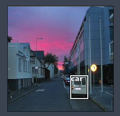

Let's break that code down a bit.

- Inspect `y` variable:

```Python
print(f'type of y: {type(y)}, y length: {len(y)}')
print(y[0].size()) # bounding box top-left coord & bottom-right coord values
print(y[1].size()) # object category (class)

# -----------------------------------------------------------------------------
# Output
# -----------------------------------------------------------------------------
type of y: <class 'list'>, y length: 2
torch.Size([64, 4])
torch.Size([64])
```

```Python
# y[0] returns 64 set of bounding boxes (labels).
# Here's we only grab the first 2 images' bounding boxes. The returned data type is PyTorch FloatTensor in GPU.
print(y[0][:2])

# Grab the first 2 images' object classes. The returned data type is PyTorch LongTensor in GPU.
print(y[1][:2])

# -----------------------------------------------------------------------------
# Output
# -----------------------------------------------------------------------------
   0    1  223  178
   7  123  186  194
[torch.cuda.FloatTensor of size 2x4 (GPU 0)]


 14
  3
[torch.cuda.LongTensor of size 2 (GPU 0)]
```

- Inspect `x` variable:
  - data from GPU

    ```Python
    x.size() # batch of 64 images, each image with 3 channels and size of 224x224

    # -----------------------------------------------------------------------------
    # Output
    # -----------------------------------------------------------------------------
    torch.Size([64, 3, 224, 224])
    ```
  - data from CPU

    ```Python
    to_np(x).shape

    # -----------------------------------------------------------------------------
    # Output
    # -----------------------------------------------------------------------------
    (64, 3, 224, 224)
    ```

#### 2. Architecture

The architecture will be the same as the one we used for the classifier and bounding box regression, but we will just combine them. In other words, if we have `c` classes, then the number of activations we need in the final layer is 4 plus `c`. 4 for bounding box coordinates and `c` probabilities (one per class).

We'll use an extra linear layer this time, plus some dropout, to help us train a more flexible model. In general, we want our custom head to be capable of solving the problem on its own if the pre-trained backbone it is connected to is appropriate. So in this case, we are trying to do quite a bit — classifier and bounding box regression, so just the single linear layer does not seem enough.

If you were wondering why there is no `BatchNorm1d` after the first `ReLU`, ResNet backbone already has `BatchNorm1d` as its final layer.

```Python
head_reg4 = nn.Sequential(
    Flatten(),
    nn.ReLU(),
    nn.Dropout(0.5),
    nn.Linear(25088, 256),
    nn.ReLU(),
    nn.BatchNorm1d(256),
    nn.Dropout(0.5),
    nn.Linear(256, 4 + len(cats))
)
models = ConvnetBuilder(f_model, 0, 0, 0, custom_head=head_reg4)

learn = ConvLearner(md, models)
learn.opt_fn = optim.Adam
```

Inspect what's inside `cats`:

```Python
print(type(cats))
print(len(cats))
print('%s, %s' % (cats[1], cats[2]))

# -----------------------------------------------------------------------------
# Output
# -----------------------------------------------------------------------------
<class 'dict'>
20
aeroplane, bicycle
```

#### 3. Loss Function

The loss function needs to look at these `4 + len(cats)` activations and decide if they are good — whether these numbers accurately reflect the position and class of the largest object in the image. We know how to do this. For the first 4 activations, we will use L1Loss just like we did before (L1Loss is like a Mean Squared Error — instead of sum of squared errors, it uses sum of absolute values). For rest of the activations, we can use cross entropy loss.

```Python
def detn_loss(input, target):
    """
    Loss function for the position and class of the largest object in the image.
    """
    bb_t, c_t = target
    # bb_i: the 4 values for the bbox
    # c_i: the 20 classes `len(cats)`
    bb_i, c_i = input[:, :4], input[:, 4:]
    bb_i = F.sigmoid(bb_i) * 224 # scale bbox values to stay between 0 and 224 (224 is the max img width or height)
    bb_l = F.l1_loss(bb_i, bb_t) # bbox loss
    clas_l = F.cross_entropy(c_i, c_t) # object class loss
    # I looked at these quantities separately first then picked a multiplier
    # to make them approximately equal
    return bb_l + clas_l * 20

def detn_l1(input, target):
    """
    Loss function for the first 4 activations.

    L1Loss is like a Mean Squared Error — instead of sum of squared errors, it uses sum of absolute values
    """
    bb_t, _ = target
    bb_i = input[:, :4]
    bb_i = F.sigmoid(bb_i) * 224
    return F.l1_loss(V(bb_i), V(bb_t)).data

def detn_acc(input, target):
    """
    Accuracy
    """
    _, c_t = target
    c_i = input[:, 4:]
    return accuracy(c_i, c_t)
```

- `input` : activations.
- `target` : ground truth.
- `bb_t, c_t = target` : our custom dataset returns a tuple containing bounding box coordinates and classes. This assignment will destructure them.
- `bb_i, c_i = input[:, :4]`, `input[:, 4:]` : the first `:` is for the batch dimension. e.g.: 64 (for 64 images).
- `b_i = F.sigmoid(bb_i) * 224` : we know our image is 224 by 224. `Sigmoid` will force it to be between 0 and 1, and multiply it by 224 to help our neural net to be in the range of what it has to be.

:question: **Question:** As a general rule, is it better to put BatchNorm before or after ReLU [00:18:02]?

Jeremy would suggest to put it after a ReLU because BatchNorm is meant to move towards zero-mean one-standard deviation. So if you put ReLU right after it, you are truncating it at zero so there is no way to create negative numbers. But if you put ReLU then BatchNorm, it does have that ability and gives slightly better results. Having said that, it is not too big of a deal either way. You see during this part of the course, most of the time, Jeremy does ReLU then BatchNorm but sometimes does the opposite when he wants to be consistent with the paper.

:question: **Question:** What is the intuition behind using dropout after a BatchNorm? Doesn't BatchNorm already do a good job of regularizing [00:19:12]?

BatchNorm does an okay job of regularizing but if you think back to part 1 when we discussed a list of things we do to avoid overfitting and adding BatchNorm is one of them as is data augmentation. But it's perfectly possible that you'll still be overfitting. One nice thing about dropout is that is it has a parameter to say how much to drop out. Parameters are great specifically parameters that decide how much to regularize because it lets you build a nice big over parameterized model and then decide on how much to regularize it. Jeremy tends to always put in a drop out starting with p=0 and then as he adds regularization, he can just change the dropout parameter without worrying about if he saved a model he want to be able to load it back, but if he had dropout layers in one but no in another, it will not load anymore. So this way, it stays consistent.

Now we have out inputs and targets, we can calculate the L1 loss and add the cross entropy [00:20:39]:

```
bb_l = F.l1_loss(bb_i, bb_t)
clas_l = F.cross_entropy(c_i, c_t)
return bb_l + clas_l * 20
```

This is our loss function. Cross entropy and L1 loss may be of wildly different scales — in which case in the loss function, the larger one is going to dominate. In this case, Jeremy printed out the values and found out that if we multiply cross entropy by 20, that makes them about the same scale.

```Python
learn.crit = detn_loss
learn.metrics = [detn_acc, detn_l1]

# Set learning rate and train
lr = 1e-2
learn.fit(lr, 1, cycle_len=3, use_clr=(32, 5))

# -----------------------------------------------------------------------------
# Output
# -----------------------------------------------------------------------------
epoch      trn_loss   val_loss   detn_acc   detn_l1
    0      71.055205  48.157942  0.754      33.202651
    1      51.411235  39.722549  0.776      26.363626
    2      42.721873  38.36225   0.786      25.658993
[array([38.36225]), 0.7860000019073486, 25.65899333190918]
```

It is nice to print out information as you train, so we grabbed L1 loss and added it as metrics.

```Python
learn.save('reg1_0')

learn.freeze_to(-2)

lrs = np.array([lr/100, lr/10, lr])

learn.fit(lrs/5, 1, cycle_len=5, use_clr=(32, 10))

# -----------------------------------------------------------------------------
# Output
# -----------------------------------------------------------------------------
epoch      trn_loss   val_loss   detn_acc   detn_l1
    0      36.650519  37.198765  0.768      23.865814
    1      30.822986  36.280846  0.776      22.743629
    2      26.792856  35.199342  0.756      21.564384
    3      23.786961  33.644777  0.794      20.626075
    4      21.58091   33.194585  0.788      20.520627
[array([33.19459]), 0.788, 20.52062666320801]
```

```Python
learn.unfreeze()

learn.fit(lrs/10, 1, cycle_len=10, use_clr=(32, 10))

# -----------------------------------------------------------------------------
# Output
# -----------------------------------------------------------------------------
epoch      trn_loss   val_loss   detn_acc   detn_l1
    0      19.133272  33.833656  0.804      20.774298
    1      18.754909  35.271939  0.77       20.572007
    2      17.824877  35.099138  0.776      20.494296
    3      16.8321    33.782667  0.792      20.139132
    4      15.968     33.525141  0.788      19.848904
    5      15.356815  33.827995  0.782      19.483242
    6      14.589975  33.49683   0.778      19.531291
    7      13.811117  33.022376  0.794      19.462907
    8      13.238251  33.300647  0.794      19.423868
    9      12.613972  33.260653  0.788      19.346758
[array([33.26065]), 0.7880000019073486, 19.34675830078125]
```

A detection accuracy is in the low 80's which is the same as what it was before. This is not surprising because ResNet was designed to do classification so we wouldn't expect to be able to improve things in such a simple way. It certainly wasn't designed to do bounding box regression. It was explicitly actually designed in such a way to not care about geometry — it takes the last 7 by 7 grid of activations and averages them all together throwing away all the information about where everything came from.

Interestingly, when we do accuracy (classification) and bounding box at the same time, the L1 seems a little bit better than when we just do bounding box regression [00:22:46].

:memo: If that is counterintuitive to you, then this would be one of the main things to think about after this lesson since it is a really important idea.

**The big idea** is this — figuring out what the main object in an image is, is kind of the hard part. Then figuring out exactly where the bounding box is and what class it is is the easy part in a way. So when you have a single network that's both saying what is the object and where is the object, it's going to share all the computation about finding the object. And all that shared computation is very efficient. When we back propagate the errors in the class and in the place, that's all the information that is going to help the computation around finding the biggest object. So anytime you have multiple tasks which share some concept of what those tasks would need to do to complete their work, it is very likely they should share at least some layers of the network together. Later, we will look at a model where most of the layers are shared except for the last one.

Here are the result [00:24:34]. As before, it does a good job when there is single major object in the image.

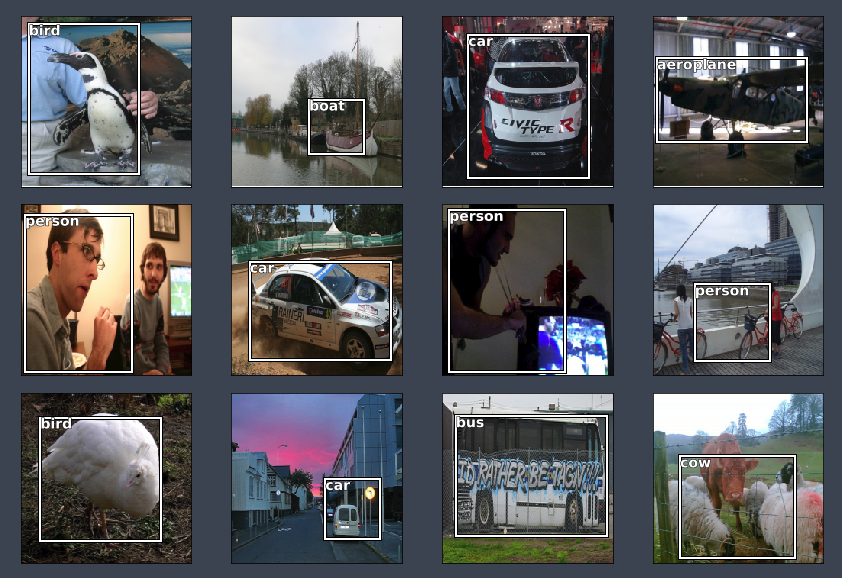

### Multi Label Classification

[pascal-multi.ipynb](https://nbviewer.jupyter.org/github/fastai/fastai/blob/master/courses/dl2/pascal-multi.ipynb)

We want to keep building models that are slightly more complex than the last model so that if something stops working, we know exactly where it broke.

#### Setup

Global scope variables:

```Python
PATH = Path('data/pascal')
trn_j = json.load((PATH / 'pascal_train2007.json').open())
IMAGES, ANNOTATIONS, CATEGORIES = ['images', 'annotations', 'categories']
FILE_NAME, ID, IMG_ID, CAT_ID, BBOX = 'file_name', 'id', 'image_id', 'category_id', 'bbox'

cats = dict((o[ID], o['name']) for o in trn_j[CATEGORIES])
trn_fns = dict((o[ID], o[FILE_NAME]) for o in trn_j[IMAGES])
trn_ids = [o[ID] for o in trn_j[IMAGES]]

JPEGS = 'VOCdevkit/VOC2007/JPEGImages'
IMG_PATH = PATH / JPEGS
```

Define common functions.

Very similar to the first Pascal notebook, a model (single object detection).

```Python
def hw_bb(bb):
    # Example, bb = [155, 96, 196, 174]
    return np.array([ bb[1], bb[0], bb[3] + bb[1] - 1, bb[2] + bb[0] - 1 ])

def get_trn_anno():
    trn_anno = collections.defaultdict(lambda:[])

    for o in trn_j[ANNOTATIONS]:
        if not o['ignore']:
            bb = o[BBOX] # one bbox. looks like '[155, 96, 196, 174]'.
            bb = hw_bb(bb)
            trn_anno[o[IMG_ID]].append( (bb, o[CAT_ID]) )
    return trn_anno

trn_anno = get_trn_anno()

def show_img(im, figsize=None, ax=None):
    if not ax:
        fig, ax = plt.subplots(figsize=figsize)
    ax.imshow(im)
    ax.set_xticks(np.linspace(0, 224, 8))
    ax.set_yticks(np.linspace(0, 224, 8))
    ax.grid()
    ax.set_xticklabels([])
    ax.set_yticklabels([])
    return ax

def draw_outline(o, lw):
    o.set_path_effects( [patheffects.Stroke(linewidth=lw, foreground='black'),
                          patheffects.Normal()] )

def draw_rect(ax, b, color='white'):
    patch = ax.add_patch(patches.Rectangle(b[:2], *b[-2:], fill=False, edgecolor=color, lw=2))
    draw_outline(patch, 4)

def draw_text(ax, xy, txt, sz=14, color='white'):
    text = ax.text(*xy, txt, verticalalignment='top', color=color, fontsize=sz, weight='bold')
    draw_outline(text, 1)

def bb_hw(a):
    return np.array( [ a[1], a[0], a[3] - a[1] + 1, a[2] - a[0] + 1 ] )

def draw_im(im, ann):
    # im is image, ann is annotations
    ax = show_img(im, figsize=(16, 8))
    for b, c in ann:
        # b is bbox, c is class id
        b = bb_hw(b)
        draw_rect(ax, b)
        draw_text(ax, b[:2], cats[c], sz=16)

def draw_idx(i):
    # i is image id
    im_a = trn_anno[i] # training annotations
    im = open_image(IMG_PATH / trn_fns[i]) # trn_fns is training image file names
    draw_im(im, im_a) # im_a is an element of annotation
```

#### Multi class

Setup.

```Python
MC_CSV = PATH / 'tmp/mc.csv'

trn_anno[12]

# -----------------------------------------------------------------------------
# Output
# -----------------------------------------------------------------------------
[(array([ 96, 155, 269, 350]), 7)]

mc = [ set( [cats[p[1]] for p in trn_anno[o] ] ) for o in trn_ids ]
mcs = [ ' '.join( str(p) for p in o ) for o in mc ] # stringify mc

print('mc:', mc[1])
print('mcs:', mcs[1])

# -----------------------------------------------------------------------------
# Output
# -----------------------------------------------------------------------------
mc: {'horse', 'person'}
mcs: horse person

df = pd.DataFrame({ 'fn': [trn_fns[o] for o in trn_ids], 'clas': mcs }, columns=['fn', 'clas'])
df.to_csv(MC_CSV, index=False)
```

:memo: One of the students pointed out that by using Pandas, we can do things much simpler than using `collections.defaultdict` and shared [this gist](https://gist.github.com/binga/1bc4ebe5e41f670f5954d2ffa9d6c0ed). The more you get to know Pandas, the more often you realize it is a good way to solve lots of different problems.

##### Model

Setup ResNet model and train.

```Python
f_model = resnet34
sz = 224
bs = 64

tfms = tfms_from_model(f_model, sz, crop_type=CropType.NO)
md = ImageClassifierData.from_csv(PATH, JPEGS, MC_CSV, tfms=tfms, bs=bs)

learn = ConvLearner.pretrained(f_model, md)
learn.opt_fn = optim.Adam

lr = 2e-2

learn.fit(lr, 1, cycle_len=3, use_clr=(32, 5))

# -----------------------------------------------------------------------------
# Output
# -----------------------------------------------------------------------------
epoch      trn_loss   val_loss   <lambda>
    0      0.319539   0.139347   0.9535
    1      0.172275   0.080689   0.9724
    2      0.116136   0.075965   0.975

[array([0.07597]), 0.9750000004768371]

# Define learning rates to search
lrs = np.array([lr/100, lr/10, lr])

# Freeze the model till the last 2 layers as before
learn.freeze_to(-2)

# Refit the model
learn.fit(lrs/10, 1, cycle_len=5, use_clr=(32, 5))

# -----------------------------------------------------------------------------
# Output
# -----------------------------------------------------------------------------
epoch      trn_loss   val_loss   <lambda>
    0      0.071997   0.078266   0.9734
    1      0.055321   0.082668   0.9737
    2      0.040407   0.077682   0.9757
    3      0.027939   0.07651    0.9756
    4      0.019983   0.07676    0.9763
[array([0.07676]), 0.9763000016212463]

# Save the model
learn.save('mclas')
learn.load('mclas')
```

##### Evaluate the model

```Python
y = learn.predict()
x, _ = next(iter(md.val_dl))
x = to_np(x)

fig, axes = plt.subplots(3, 4, figsize=(12, 8))

for i, ax in enumerate(axes.flat):
    ima = md.val_ds.denorm(x)[i]
    ya = np.nonzero(y[i] > 0.4)[0]
    b = '\n'.join(md.classes[o] for o in ya)
    ax = show_img(ima, ax=ax)
    draw_text(ax, (0, 0), b)
plt.tight_layout()
```

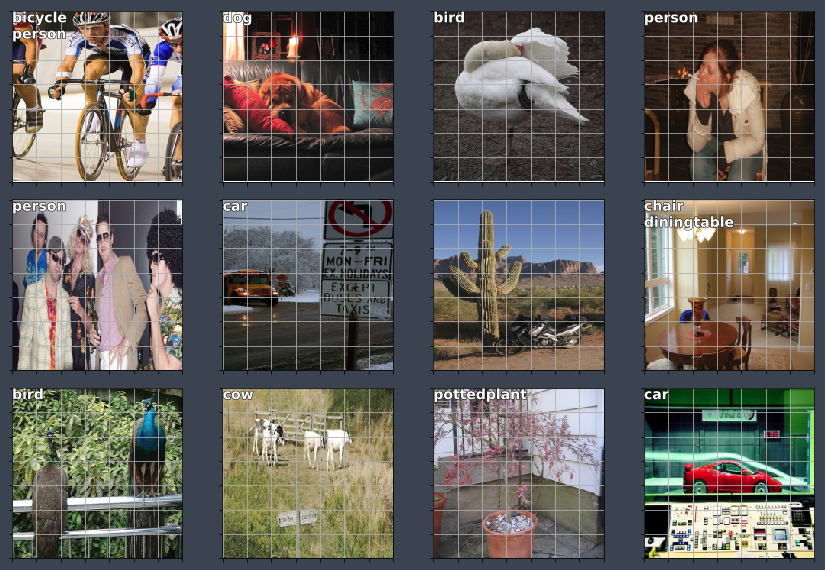

Multi-class classification is pretty straight forward [00:28:28]. One minor tweak is the use of `set` in this line so that each object type appear once:

```Python
mc = [ set( [cats[p[1]] for p in trn_anno[o] ] ) for o in trn_ids ]
```

Next up, **finding multiple objects in an image**.

#### SSD and YOLO

We have an input image that goes through a conv net which outputs a vector of size `4 + c` where `c = len(cats)` . This gives us an object detector for a single largest object. Let's now create one that finds 16 objects. The obvious way to do this would be to take the last linear layer and rather than having `4 + c` outputs, we could have `16 x (4+c)` outputs. This gives us 16 sets of class probabilities and 16 sets of bounding box coordinates. Then we would just need a loss function that will check whether those 16 sets of bounding boxes correctly represented the up to 16 objects in the image (we will go into the loss function later).

The second way to do this is rather than using `nn.linear`, what if instead, we took from our ResNet convolutional backbone and added an nn.Conv2d with stride 2 [00:31:32]? This will give us a `4 x 4 x [# of filters]` tensor — here let's make it `4 x 4 x (4 + c)` so that we get a tensor where the number of elements is exactly equal to the number of elements we wanted. Now if we created a loss function that took a `4 x 4 x (4 + c)` tensor and and mapped it to 16 objects in the image and checked whether each one was correctly represented by these `4 + c` activations, this would work as well. It turns out, both of these approaches are actually used [00:33:48]. The approach where the output is one big long vector from a fully connected linear layer is used by a class of models known as [YOLO (You Only Look Once)](https://arxiv.org/abs/1506.02640), where else, the approach of the convolutional activations is used by models which started with something called [SSD (Single Shot Detector)](https://arxiv.org/abs/1512.02325). Since these things came out very similar times in late 2015, things are very much moved towards SSD. So the point where this morning, [YOLO version 3](https://pjreddie.com/media/files/papers/YOLOv3.pdf) came out and is now doing SSD, so that's what we are going to do. We will also learn about why this makes more sense as well.


#### Anchor Boxes

##### SSD Approach

Let's imagine that we had another `Conv2d(stride=2)` then we would have `2 x 2 x (4 + c)` tensor. Basically, it is creating a grid that looks something like this:

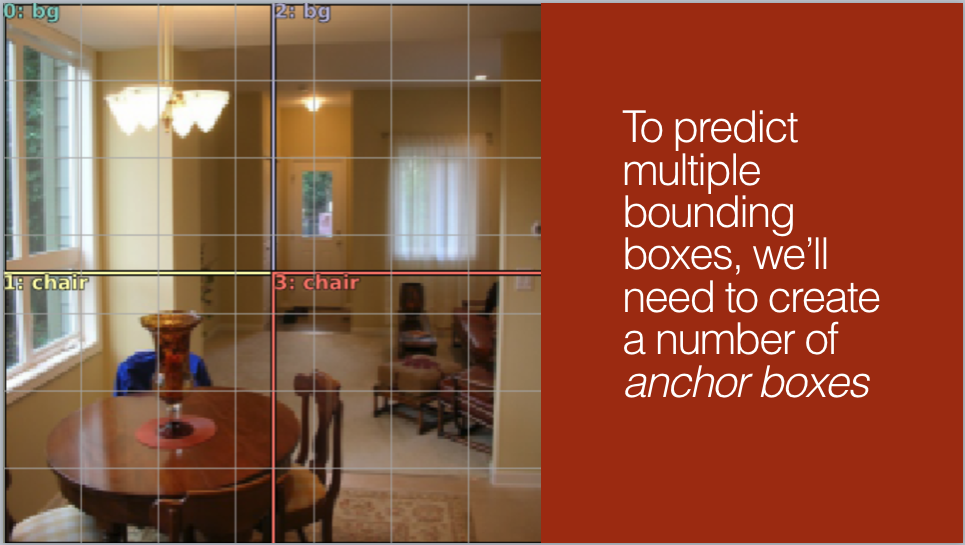

This is how the geometry of the activations of the second extra convolutional stride 2 layer are.

What we might do here [00:36:09]? We want each of these grid cell (Conv quadrant) to be responsible for finding the largest object in that part of the image.

#### Receptive Field

Why do we want each convolutional grid cell (quadrant) to be responsible for finding things that are in the corresponding part of the image? The reason is because of something called the receptive field of that convolutional grid cell. The basic idea is that throughout your convolutional layers, every piece of those tensors has a receptive field which means which part of the input image was responsible for calculating that cell. Like all things in life, the easiest way to see this is with Excel [00:38:01].

Take a single activation (in this case in the maxpool layer) and let's see where it came from [00:38:45]. In Excel you can do Formulas :arrow_right: Trace Precedents. Tracing all the way back to the input layer, you can see that it came from this 6 x 6 portion of the image (as well as filters).

**Example:**

If we trace one of the maxpool activation backwards:

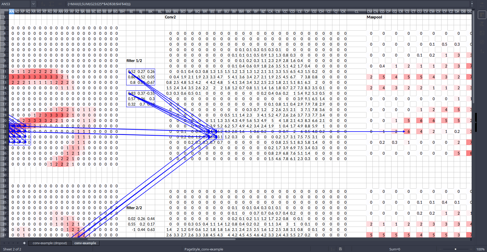

Tracing back even farther until we get back to the source image:

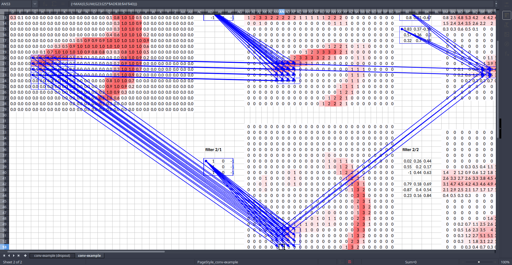

What is more, the middle portion has lots of weights (or connections) coming out of where else, cells in the outside (edges) only have one (don't have many) weight coming out. In other words, the center of the box has more dependencies. So we call this 6 x 6 cells the receptive field of the one activation we picked.

_Note that the receptive field is not just saying it's this box but also that the center of the box has more dependencies [00:40:27]._ This is **a critically important concept when it comes to understanding architectures and understanding why conv nets work the way they do**.

#### Make a model to predict what shows up in a 4x4 grid

We're going to make a simple first model that simply predicts what object is located in each cell of a 4x4 grid. Later on we can try to improve this.

##### Architecture

The architecture is, we will have a ResNet backbone followed by one or more 2D convolutions (one for now) which is going to give us a `4x4` grid.

```Python
# Build a simple convolutional model
class StdConv(nn.Module):
    """
    A combination block of Conv2d, BatchNorm, Dropout
    """
    def __init__(self, nin, nout, stride=2, drop=0.1):
        super().__init__()
        self.conv = nn.Conv2d(nin, nout, 3, stride=stride, padding=1)
        self.bn = nn.BatchNorm2d(nout)
        self.drop = nn.Dropout(drop)

    def forward(self, x):
        return self.drop(self.bn(F.relu(self.conv(x))))

def flatten_conv(x, k):
    bs, nf, gx, gy = x.size()
    x = x.permute(0, 2, 3, 1).contiguous()
    return x.view(bs, -1, nf//k)

# This is an output convolutional model with 2 `Conv2d` layers.
class OutConv(nn.Module):
    """
    A combination block of `Conv2d`, `4 x Stride 1`, `Conv2d`, `C x Stride 1` with two layers.

    We are outputting `4 + C`
    """
    def __init__(self, k, nin, bias):
        super().__init__()
        self.k = k
        self.oconv1 = nn.Conv2d(nin, (len(id2cat) + 1) * k, 3, padding=1) # +1 is adding one more class for background.
        self.oconv2 = nn.Conv2d(nin, 4 * k, 3, padding=1)
        self.oconv1.bias.data.zero_().add(bias)

    def forward(self, x):
        return [flatten_conv(self.oconv1(x), self.k),
                flatten_conv(self.oconv2(x), self.k)]
```

**The SSD Model**

```Python
class SSD_Head(nn.Module):
    def __init__(self, k, bias):
        super().__init__()
        self.drop = nn.Dropout(0.25)
        # Stride 1 conv doesn't change the dimension size, but we have a mini neural network
        self.sconv0 = StdConv(512, 256, stride=1)
        self.sconv2 = StdConv(256, 256)
        self.out = OutConv(k, 256, bias)

    def forward(self, x):
        x = self.drop(F.relu(x))
        x = self.sconv0(x)
        x = self.sconv2(x)
        return self.out(x)

head_reg4 = SSD_Head(k, -3.)
models = ConvnetBuilder(f_model, 0, 0, 0, custom_head=head_reg4)
learn = ConvLearner(md, models)
learn.opt_fn = optim.Adam
```

SSD_Head:

1. We start with ReLU and dropout.
2. Then stride 1 convolution.

    The reason we start with a stride 1 convolution is because that does not change the geometry at all— it just lets us add an extra layer of calculation. It lets us create not just a linear layer but now we have a little **mini neural network** in our custom head. `StdConv` is defined above — it does convolution, ReLU, BatchNorm, and dropout. _Most research code you see won't define a class like this, instead they write the entire thing again and again._ Don't be like that. Duplicate code leads to errors and poor understanding.
3. Stride 2 convolution [00:44:56].
4. At the end, the output of step 3 is `4x4` which gets passed to `OutConv`.

    `OutConv` has two separate convolutional layers each of which is stride 1 so it is not changing the geometry of the input. One of them is of length of the number of classes (ignore `k` for now and `+1` is for "background" — i.e. no object was detected), the other's length is 4.

    Rather than having a single conv layer that outputs `4 + c`, let's have two conv layers and return their outputs in a list.

    > This allows these layers to specialize just a little bit. We talked about this idea that when you have multiple tasks, they can share layers, but they do not have to share all the layers.

    In this case, our two tasks of creating a classifier and creating bounding box regression share every single layers except the very last one.
5. At the end, we flatten out the convolution because Jeremy wrote the loss function to expect flattened out tensor, but we could totally rewrite it to not do that.

#### [Fastai Coding Style](https://github.com/fastai/fastai/blob/master/docs/style.md)

It is very heavily orient towards the idea of expository programming which is the idea that programming code should be something that you can use to explain an idea, ideally as readily as mathematical notation, to somebody that understands your coding method.

**How do we write a loss function for this?**

The loss function needs to look at each of these 16 sets of activations, each of which has **4 bounding box coordinates** and **categories + 1** — `c + 1` class probabilities and decide if those activations are close or far away from the object which is the closest to this grid cell in the image. If nothing is there, then whether it is predicting background correctly. That turns out to be very hard to do.

**Matching Problem**

The loss function actually needs to take each object in the image and match them to a convolutional grid cell.

The loss function needs to take each of the objects in the image and match them to one of these convolutional grid cells to say "this grid cell is responsible for this particular object" so then it can go ahead and say "okay, how close are the 4 coordinates and how close are the class probabilities".

Here's our goal:


Our dependent variable looks like the one on the left, and our final convolutional layer is going to be `4 x 4 x (c + 1)` in this case `c = 20`. We then flatten that out into a vector. Our goal is to come up with a function which takes in a dependent variable and also some particular set of activations that ended up coming out of the model and returns a higher number if these activations are not a good reflection of the ground truth bounding boxes; or a lower number if it is a good reflection.

**Testing**

Do a simple test to make sure that model works.

```Python
x, y = next(iter(md.val_dl))
x, y = V(x), V(y)
```

```Python
for i, o in enumerate(y):
    y[i] = o.cuda()
learn.model.cuda()

# -----------------------------------------------------------------------------
# Output
# -----------------------------------------------------------------------------
Sequential(
  (0): Conv2d(3, 64, kernel_size=(7, 7), stride=(2, 2), padding=(3, 3), bias=False)
  (1): BatchNorm2d(64, eps=1e-05, momentum=0.1, affine=True)
  (2): ReLU(inplace)
  (3): MaxPool2d(kernel_size=(3, 3), stride=(2, 2), padding=(1, 1), dilation=(1, 1), ceil_mode=False)
  (4): Sequential(
    (0): BasicBlock(
      (conv1): Conv2d(64, 64, kernel_size=(3, 3), stride=(1, 1), padding=(1, 1), bias=False)
      (bn1): BatchNorm2d(64, eps=1e-05, momentum=0.1, affine=True)
      (relu): ReLU(inplace)
      (conv2): Conv2d(64, 64, kernel_size=(3, 3), stride=(1, 1), padding=(1, 1), bias=False)
      (bn2): BatchNorm2d(64, eps=1e-05, momentum=0.1, affine=True)
    )
    (1): BasicBlock(
      (conv1): Conv2d(64, 64, kernel_size=(3, 3), stride=(1, 1), padding=(1, 1), bias=False)
      (bn1): BatchNorm2d(64, eps=1e-05, momentum=0.1, affine=True)
      (relu): ReLU(inplace)
      (conv2): Conv2d(64, 64, kernel_size=(3, 3), stride=(1, 1), padding=(1, 1), bias=False)
      (bn2): BatchNorm2d(64, eps=1e-05, momentum=0.1, affine=True)
    )
    (2): BasicBlock(
      (conv1): Conv2d(64, 64, kernel_size=(3, 3), stride=(1, 1), padding=(1, 1), bias=False)
      (bn1): BatchNorm2d(64, eps=1e-05, momentum=0.1, affine=True)
      (relu): ReLU(inplace)
      (conv2): Conv2d(64, 64, kernel_size=(3, 3), stride=(1, 1), padding=(1, 1), bias=False)
      (bn2): BatchNorm2d(64, eps=1e-05, momentum=0.1, affine=True)
    )
  )
  ...   ...     ...
  ...   ...     ...
  (8): SSD_Head(
    (drop): Dropout(p=0.25)
    (sconv0): StdConv(
      (conv): Conv2d(512, 256, kernel_size=(3, 3), stride=(1, 1), padding=(1, 1))
      (bn): BatchNorm2d(256, eps=1e-05, momentum=0.1, affine=True)
      (drop): Dropout(p=0.1)
    )
    (sconv2): StdConv(
      (conv): Conv2d(256, 256, kernel_size=(3, 3), stride=(2, 2), padding=(1, 1))
      (bn): BatchNorm2d(256, eps=1e-05, momentum=0.1, affine=True)
      (drop): Dropout(p=0.1)
    )
    (out): OutConv(
      (oconv1): Conv2d(256, 21, kernel_size=(3, 3), stride=(1, 1), padding=(1, 1))
      (oconv2): Conv2d(256, 4, kernel_size=(3, 3), stride=(1, 1), padding=(1, 1))
    )
  )
)
```

```Python
batch = learn.model(x)

anchors = anchors.cuda()
grid_sizes = grid_sizes.cuda()
anchor_cnr = anchor_cnr.cuda()

ssd_loss(batch, y, True)

# -----------------------------------------------------------------------------
# Output
# -----------------------------------------------------------------------------
 0.4062
 0.2180
 0.1307
 0.5762
 0.1524
 0.4794
[torch.cuda.FloatTensor of size 6 (GPU 0)]


 0.1128
[torch.cuda.FloatTensor of size 1 (GPU 0)]

loc: 10.360502243041992, clas: 73.66346740722656
Variable containing:
 84.0240
[torch.cuda.FloatTensor of size 1 (GPU 0)]
```

```Python
x, y = next(iter(md.val_dl)) # grab a single batch
x, y = V(x), V(y) # turn into variables
learn.model.eval() # set model to eval mode (trained in the previous block)
batch = learn.model(x)
b_clas, b_bb = batch # destructure the class and the bounding box
```

```Python
b_clas.size(), b_bb.size()

# -----------------------------------------------------------------------------
# Output
# -----------------------------------------------------------------------------
(torch.Size([64, 16, 21]), torch.Size([64, 16, 4]))
```

The dimension:
- 64 batch size by
- 16 grid cells
- 21 classes
- 4 bounding box coords

**Let's now look at the ground truth `y`.**

We will look at image 7.

```Python
idx = 7
b_clasi = b_clas[idx]
b_bboxi = b_bb[idx]
ima = md.val_ds.ds.denorm(to_np(x))[idx]
bbox, clas = get_y(y[0][idx], y[1][idx])
bbox, clas

# -----------------------------------------------------------------------------
# Output
# -----------------------------------------------------------------------------
(Variable containing:
  0.6786  0.4866  0.9911  0.6250
  0.7098  0.0848  0.9911  0.5491
  0.5134  0.8304  0.6696  0.9063
 [torch.cuda.FloatTensor of size 3x4 (GPU 0)], Variable containing:
   8
  10
  17
 [torch.cuda.LongTensor of size 3 (GPU 0)])
```

_Note that the bounding box coordinates have been scaled to between 0 and 1._

```Python
def torch_gt(ax, ima, bbox, clas, prs=None, thresh=0.4):
    """
    We already have `show_ground_truth` function.

    This function simply converts tensors into numpy array. (gt stands for ground truth)
    """
    return show_ground_truth(ax, ima, to_np((bbox * 224).long()),
                             to_np(clas), to_np(prs) if prs is not None else None, thresh)
```

```Python
fig, ax = plt.subplots(figsize=(7, 7))
torch_gt(ax, ima, bbox, clas)
```


The above is a ground truth.

Here is our 4x4 grid cells from our final convolutional layer.

```Python
fig, ax = plt.subplots(figsize=(7, 7))
torch_gt(ax, ima, anchor_cnr, b_clasi.max(1)[1])
```

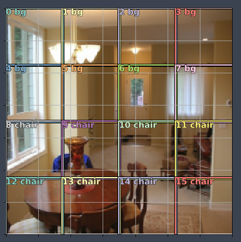

Each of these square boxes, different papers call them different things. The three terms you'll hear are: anchor boxes, prior boxes, or default boxes. We will stick with the term **anchor boxes**.

What we are going to do for this **loss function** is we are going to go through a **matching problem** where we are going to **take every one of these 16 boxes and see which one of these three ground truth objects has the highest amount of overlap with a given square**.

To do this, we have to have some way of measuring **amount of overlap** and a standard function for this is called [**Jaccard index**](https://en.wikipedia.org/wiki/Jaccard_index) (IoU).

`IoU = area of overlap / area of union`

We are going to go through and find the Jaccard overlap for each one of the three objects versus each of the 16 anchor boxes [00:57:11]. That is going to give us a `3x16` matrix.

Here are the coordinates of all of our anchor boxes (center `x`, center `y`, height, width):

```
anchors
# -----------------------------------------------------------------------------
# Output
# -----------------------------------------------------------------------------
Variable containing:
 0.1250  0.1250  0.2500  0.2500
 0.1250  0.3750  0.2500  0.2500
 0.1250  0.6250  0.2500  0.2500
 0.1250  0.8750  0.2500  0.2500
 0.3750  0.1250  0.2500  0.2500
 0.3750  0.3750  0.2500  0.2500
 0.3750  0.6250  0.2500  0.2500
 0.3750  0.8750  0.2500  0.2500
 0.6250  0.1250  0.2500  0.2500
 0.6250  0.3750  0.2500  0.2500
 0.6250  0.6250  0.2500  0.2500
 0.6250  0.8750  0.2500  0.2500
 0.8750  0.1250  0.2500  0.2500
 0.8750  0.3750  0.2500  0.2500
 0.8750  0.6250  0.2500  0.2500
 0.8750  0.8750  0.2500  0.2500
[torch.cuda.FloatTensor of size 16x4 (GPU 0)]
```

Here are the amount of overlap between 3 ground truth objects and 16 anchor boxes:

Get the activations.

```Python
# a_ic: activations image corners
a_ic = actn_to_bb(b_bboxi, anchors)

fig, ax = plt.subplots(figsize=(7, 7))

# b_clasi.max(1)[1] -> object class id
# b_clasi.max(1)[0].sigmoid() -> scale class probs using sigmoid
torch_gt(ax, ima, a_ic, b_clasi.max(1)[1], b_clasi.max(1)[0].sigmoid(), thresh=0.0)
```

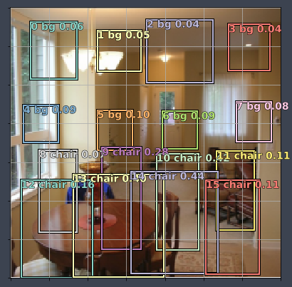

**Calculate Jaccard index (all objects `x` all grid cells)**

We are going to go through and find the Jaccard overlap for each one of the 3 ground truth objects versus each of the 16 anchor boxes. That is going to give us a `3x16` matrix.

```Python
# Test ssd_1_loss logic
overlaps = jaccard(bbox.data, anchor_cnr.data)
overlaps

# -----------------------------------------------------------------------------
# Output
# -----------------------------------------------------------------------------
Columns 0 to 9
 0.0000  0.0000  0.0000  0.0000  0.0000  0.0000  0.0000  0.0000  0.0000  0.0091
 0.0000  0.0000  0.0000  0.0000  0.0000  0.0000  0.0000  0.0000  0.0356  0.0549
 0.0000  0.0000  0.0000  0.0000  0.0000  0.0000  0.0000  0.0000  0.0000  0.0000

Columns 10 to 15
 0.0922  0.0000  0.0000  0.0315  0.3985  0.0000
 0.0103  0.0000  0.2598  0.4538  0.0653  0.0000
 0.0000  0.1897  0.0000  0.0000  0.0000  0.0000
[torch.cuda.FloatTensor of size 3x16 (GPU 0)]
```

What we could do now is we could take the max of dimension (axis) 1 (row-wise) which will tell us for each ground truth object, what the maximum amount that overlaps with some grid cell as well as the index:

```Python
# For each object, we can find the highest overlap with any grid cell.
# Returns maximum amount and the corresponding cell index.
overlaps.max(1) # axis 1 -> horizontal (left-to-right)

# -----------------------------------------------------------------------------
# Output
# -----------------------------------------------------------------------------
(
  0.3985
  0.4538
  0.1897
 [torch.cuda.FloatTensor of size 3 (GPU 0)],
  14
  13
  11
 [torch.cuda.LongTensor of size 3 (GPU 0)])
```

We will also going to look at max over a dimension(axis) 0 (column-wise) which will tell us what is the maximum amount of overlap for each grid cell across all of the ground truth objects:

```Python
overlaps.max(0) # axis 0 -> vertical (top-to-bottom)

# -----------------------------------------------------------------------------
# Output
# -----------------------------------------------------------------------------
(
  0.0000
  0.0000
  0.0000
  0.0000
  0.0000
  0.0000
  0.0000
  0.0000
  0.0356
  0.0549
  0.0922
  0.1897
  0.2598
  0.4538
  0.3985
  0.0000
 [torch.cuda.FloatTensor of size 16 (GPU 0)],
  0
  0
  0
  0
  0
  0
  0
  0
  1
  1
  0
  2
  1
  1
  0
  0
 [torch.cuda.LongTensor of size 16 (GPU 0)])
```

Here, it tells us for every grid cell what is the index of the ground truth object which overlaps with it the most.

Basically what `map_to_ground_truth` does is it combines these two sets of overlaps in a way described in the **SSD paper** to assign every anchor box to a ground truth object.

The way it assign that is each of the three (row-wise max) gets assigned as is. For the rest of the anchor boxes, they get assigned to anything which they have an overlap of at least 0.5 with (column-wise). If neither applies, it is considered to be a cell which contains background.

Now you can see a list of all the assignments:

```Python
# Test ssd_1_loss logic

# ground truth overlap and index
gt_overlap, gt_idx = map_to_ground_truth(overlaps)
gt_overlap, gt_idx

# -----------------------------------------------------------------------------
# Output
# -----------------------------------------------------------------------------
(
  0.0000
  0.0000
  0.0000
  0.0000
  0.0000
  0.0000
  0.0000
  0.0000
  0.0356
  0.0549
  0.0922
  1.9900
  0.2598
  1.9900
  1.9900
  0.0000
 [torch.cuda.FloatTensor of size 16 (GPU 0)],
  0
  0
  0
  0
  0
  0
  0
  0
  1
  1
  0
  2
  1
  1
  0
  0
 [torch.cuda.LongTensor of size 16 (GPU 0)])
```

Anywhere that has `gt_overlap < 0.5` gets assigned background. The three row-wise max anchor box has high number to force the assignments. Now we can combine these values to classes:

```Python
# ground truth class
gt_clas = clas[gt_idx]
gt_clas

# -----------------------------------------------------------------------------
# Output
# -----------------------------------------------------------------------------
Variable containing:
  8
  8
  8
  8
  8
  8
  8
  8
 10
 10
  8
 17
 10
 10
  8
  8
[torch.cuda.LongTensor of size 16 (GPU 0)]
```

Then add a threshold and finally comes up with the three classes that are being predicted:

```Python
# Test ssd_1_loss logic

thresh = 0.5
# Get positive indices
pos = gt_overlap > thresh
print(pos)
pos_idx = torch.nonzero(pos)[:, 0]

# Get negative indices
neg_idx = torch.nonzero(1 - pos)[:, 0]
print(neg_idx)

print(pos_idx)

# -----------------------------------------------------------------------------
# Output
# -----------------------------------------------------------------------------
 0
 0
 0
 0
 0
 0
 0
 0
 0
 0
 0
 1
 0
 1
 1
 0
[torch.cuda.ByteTensor of size 16 (GPU 0)]


  0
  1
  2
  3
  4
  5
  6
  7
  8
  9
 10
 12
 15
[torch.cuda.LongTensor of size 13 (GPU 0)]


 11
 13
 14
[torch.cuda.LongTensor of size 3 (GPU 0)]
```

And here are what each of these anchor boxes is meant to be predicting:

```Python
# flip negative class to bg class id
gt_clas[1 - pos] = len(id2cat) # len id2cat is 20
print(gt_clas.data)
[id2cat[o] if o < len(id2cat) else 'bg' for o in gt_clas.data]

# -----------------------------------------------------------------------------
# Output
# -----------------------------------------------------------------------------
 20
 20
 20
 20
 20
 20
 20
 20
 20
 20
 20
 17
 20
 10
  8
 20
[torch.cuda.LongTensor of size 16 (GPU 0)]

['bg',
 'bg',
 'bg',
 'bg',
 'bg',
 'bg',
 'bg',
 'bg',
 'bg',
 'bg',
 'bg',
 'sofa',
 'bg',
 'diningtable',
 'chair',
 'bg']
```

So that was the matching stage.

For **L1 loss**, we can:

1. take the activations which matched (`pos_idx = [11, 13, 14]`).
2. subtract from those the ground truth bounding boxes.
3. take the absolute value of the difference.
4. take the mean of that.

For classifications, we can just do a cross entropy.

```Python
# Test ssd_1_loss logic
gt_bbox = bbox[gt_idx]
loc_loss = ( ( a_ic[pos_idx] - gt_bbox[pos_idx] ).abs() ).mean()
clas_loss = F.cross_entropy(b_clasi, gt_clas)
loc_loss, clas_loss

# -----------------------------------------------------------------------------
# Output
# -----------------------------------------------------------------------------
(Variable containing:
 1.00000e-02 *
   6.3030
 [torch.cuda.FloatTensor of size 1 (GPU 0)], Variable containing:
  0.9787
 [torch.cuda.FloatTensor of size 1 (GPU 0)])
```

**Result**

We will end up with 16 predicted bounding boxes, most of them will be background. If you are wondering what it predicts in terms of bounding box of background, the answer is it totally ignores it.

```Python
# Plot a few pictures
fig, axes = plt.subplots(3, 4, figsize=(16, 12))

for idx, ax in enumerate(axes.flat):
    # loop through each image out of 12 images
    ima = md.val_ds.ds.denorm(to_np(x))[idx]
    bbox, clas = get_y(y[0][idx], y[1][idx])
    ima = md.val_ds.ds.denorm(to_np(x))[idx]
    bbox, clas = get_y(bbox, clas); bbox, clas
    a_ic = actn_to_bb(b_bb[idx], anchors)
    torch_gt(ax, ima, a_ic, b_clas[idx].max(1)[1], b_clas[idx].max(1)[0].sigmoid(), 0.01)
plt.tight_layout()
```

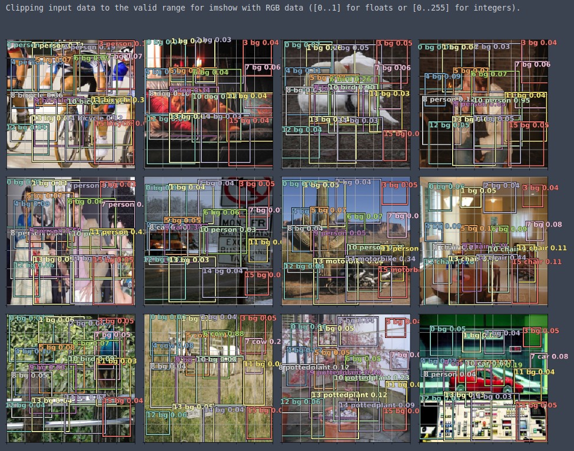

In practice, we want to remove the background and also add some threshold for probabilities, but it is on the right track. The potted plant image, the result is not surprising as all of our anchor boxes were small (4x4 grid).

How can we improve?

To go from here to something that is going to be more accurate, all we are going to do is to create way more anchor boxes.

**Tweak 1. How do we interpret the activations**

We have to convert the activations into a scaling. We grab the activations, we stick them through `tanh` (it is scaled to be between -1 and 1) which forces it to be within that range.

We then grab the actual position of the anchor boxes, and we will move them around according to the value of the activations divided by two. In other words, each predicted bounding box can be moved by up to 50% of a grid size from where its default position is.

```Python
def actn_to_bb(actn, anchors):
    # e.g. of actn tensor of shape (16, 4): [[0.2744 0.2912 -0.3941 -0.7735], [...]]

    # normalize actn values between 1 and -1 (tanh func)
    actn_bbs = torch.tanh(actn)
    # actn_bbs[:, :2] grab the first 2 columns (obj bbox top-left coords) from the tensor & scale back the coords to grid sizes
    # anchors[:, :2] grab the first 2 columns (center point coords)
    actn_centers = (actn_bbs[:, :2] / 2 * grid_sizes) + anchors[:, :2]
    # same as above but this time for bbox area (height/width)
    actn_hw = (actn_bbs[:, 2:] / 2 + 1) * anchors[:, 2:]
    return hw2corners(actn_centers, actn_hw)
```

**Tweak 2. We actually use binary cross entropy loss instead of cross entropy.**

Binary cross entropy is what we normally use for multi-label classification.

If it has multiple things in it, you cannot use softmax because softmax really encourages just one thing to have the high number. In our case, each anchor box can only have one object associated with it, so it is not for that reason that we are avoiding softmax. It is something else — which is it is possible for an anchor box to have nothing associated with it. There are two ways to handle this idea of "background"; one would be to say background is just a class, so let's use softmax and just treat background as one of the classes that the softmax could predict. A lot of people have done it this way. But that is a really hard thing to ask neural network to do—it is basically asking whether this grid cell does not have any of the 20 objects that I am interested with Jaccard overlap of more than 0.5. It is a really hard thing to put into a single computation. On the other hand, what if we just asked for each class; "is it a motorbike?", "is it a bus?", etc and if all the answer is no, consider that background. That is the way we do it here. It is not that we can have multiple true labels, but we can have zero.

```Python
class BCE_Loss(nn.Module):
    """
    Binomial Cross Entropy Loss.

    Each anchor box can only have one object associated with it. Its possible for an anchor box to have NOTHING in it.
    We could:

    1. treat background as a class - difficult, because its asking the NN to say 'does this square NOT have 20 other things'
    2. BCE loss, checks by process of elimination - if there's no 20 object detected, then its background (0 positives)
    """
    def __init__(self, num_classes):
        super().__init__()
        self.num_classes = num_classes

    def forward(self, pred, targ):
        # take the one hot embedding of the target (at this stage, we do have the idea of background)
        t = one_hot_embedding(targ, self.num_classes + 1)
        # remove the background column (the last one) which results in a vector either of all zeros or one one
        t = V(t[:, :-1].contiguous())#.cpu()
        x = pred[:, :-1]
        w = self.get_weight(x, t)
        # use binary cross-entropy predictions
        return F.binary_cross_entropy_with_logits(x, t, w, size_average=False) / self.num_classes

    def get_weight(self, x, t):
        return None
```

This is a minor tweak, but it is the kind of minor tweak that Jeremy wants you to think about and understand because it makes a really big difference to your training and when there is some increment over a previous paper, it would be something like this [01:08:25]. It is important to understand what this is doing and more importantly why.

Now all it's left is SSD loss function.

```Python
def ssd_1_loss(b_c, b_bb, bbox, clas, print_it=False):
    bbox, clas = get_y(bbox, clas)
    a_ic = actn_to_bb(b_bb, anchors)
    overlaps = jaccard(bbox.data, anchor_cnr.data)
    gt_overlap, gt_idx = map_to_ground_truth(overlaps, print_it)
    gt_clas = clas[gt_idx]
    pos = gt_overlap > 0.4
    pos_idx = torch.nonzero(pos)[:, 0]
    gt_clas[1 - pos] = len(id2cat)
    gt_bbox = bbox[gt_idx]
    loc_loss = ( (a_ic[pos_idx] - gt_bbox[pos_idx]).abs() ).mean()
    clas_loss = loss_f(b_c, gt_clas)
    return loc_loss, clas_loss

def ssd_loss(pred, targ, print_it=False):
    lcs, lls = 0., 0.
    for b_c, b_bb, bbox, clas in zip(*pred, *targ):
        loc_loss, clas_loss = ssd_1_loss(b_c, b_bb, bbox, clas, print_it)
        lls += loc_loss
        lcs += clas_loss
    if print_it:
        print(f'loc: {lls.data[0]}, clas: {lcs.data[0]}')
    return lls + lcs
```

The `ssd_loss` function which is what we set as the criteria, it loops through each image in the mini-batch and `call ssd_1_loss` function (i.e. SSD loss for one image).

`ssd_1_loss` is where it is all happening. It begins by de-structuring `bbox` and `clas`.

Let's take a closer look at `get_y`.

```Python
def get_y(bbox, clas):
    bbox = bbox.view(-1, 4) / sz
    bb_keep = ( (bbox[:, 2] - bbox[:, 0]) > 0 ).nonzero()[:, 0]
    return bbox[bb_keep], clas[bb_keep]
```

A lot of code you find on the Internet does not work with mini-batches. It only does one thing at a time which we don't want. In this case, all these functions (`get_y`, `actn_to_bb`, `map_to_ground_truth`) is working on, not exactly a mini-batch at a time, but a whole bunch of ground truth objects at a time. The data loader is being fed a mini-batch at a time to do the convolutional layers.

Because we can have _different numbers of ground truth objects in each image_ but a tensor has to be the strict rectangular shape, fastai automatically pads it with zeros (any target values that are shorter). This was something that was added recently and super handy, but that does mean that you then have to make sure that you get rid of those zeros. So `get_y` gets rid of any of the bounding boxes that are just padding.

#### More anchors!

There are 3 ways to do this:

1. Create anchor boxes of different sizes (zoom).
2. Create anchor boxes of different aspect ratios.
3. Use more convolutional layers as sources of anchor boxes (the boxes are randomly jittered so that we can see ones that are overlapping.

Combining these approaches, you can create lots of anchor boxes.


**Create anchors**

```Python
anc_grids = [4, 2, 1]
anc_zooms = [0.7, 1., 1.3]
anc_ratios = [(1., 1.), (1., 0.5), (0.5, 1.)]
anchor_scales = [(anz * i, anz * j) for anz in anc_zooms for (i, j) in anc_ratios]
k = len(anchor_scales)
anc_offsets = [1 / (o * 2) for o in anc_grids]
```

Make the corners:

```Python
anc_x = np.concatenate([np.repeat(np.linspace(ao, 1 - ao, ag), ag)
                        for ao, ag in zip(anc_offsets, anc_grids)])
anc_y = np.concatenate([np.tile(np.linspace(ao, 1 - ao, ag), ag)
                        for ao, ag in zip(anc_offsets, anc_grids)])
anc_ctrs = np.repeat(np.stack([anc_x, anc_y], axis=1), k, axis=0)
```

Make the dimensions:

```Python
anc_sizes = np.concatenate([np.array([[o / ag, p / ag] for i in range(ag * ag) for o, p in anchor_scales])
                           for ag in anc_grids])
grid_sizes = V(np.concatenate([np.array([1 / ag for i in range(ag * ag) for o, p in anchor_scales])
               for ag in anc_grids]), requires_grad=False).unsqueeze(1)
anchors = V(np.concatenate([anc_ctrs, anc_sizes], axis=1), requires_grad=False).float()
anchor_cnr = hw2corners(anchors[:, :2], anchors[:, 2:])
```

`anchors` : center and height, width
`anchor_cnr` : top-left and bottom-right corners

##### Model Architecture

We will change our architecture, so it spits out enough activations.

Try to make the activations closely represents the bounding box.

- Now we can have multiple anchor boxes per grid cell.
- For every object, have to figure out which anchor box which is closer.
- For each anchor box, we have to find which object its responsible for.
- We don't need to necessarily change the number of conv. filters. We will get these for free.

The model is nearly identical to what we had before. But we have a number of stride 2 convolutions which is going to take us through to 4x4, 2x2, and 1x1 (each stride 2 convolution halves our grid size in both directions).

- After we do our first convolution to get to 4x4, we will grab a set of outputs from that because we want to save away the 4x4 anchors.
- Once we get to 2x2, we grab another set of now 2x2 anchors.
- Then finally we get to 1x1.
- We then concatenate them all together, which gives us the correct number of activations (one activation for every anchor box).

```Python
drop = 0.4

class SSD_MultiHead(nn.Module):
    def __init__(self, k, bias):
        """
        k: Number of zooms x number of aspect ratios. Grids will be for free.
        """
        super().__init__()
        self.drop = nn.Dropout(drop)
        self.sconv0 = StdConv(512, 256, stride=1, drop=drop)
        self.sconv1 = StdConv(256, 256, drop=drop)
        self.sconv2 = StdConv(256, 256, drop=drop)
        self.sconv3 = StdConv(256, 256, drop=drop)
        # Note the number of OutConv. There's many more outputs this time around.
        self.out0 = OutConv(k, 256, bias)
        self.out1 = OutConv(k, 256, bias)
        self.out2 = OutConv(k, 256, bias)
        self.out3 = OutConv(k, 256, bias)

    def forward(self, x):
        x = self.drop(F.relu(x))
        x = self.sconv0(x)
        x = self.sconv1(x)
        o1c, o1l = self.out1(x)
        x = self.sconv2(x)
        o2c, o2l = self.out2(x)
        x = self.sconv3(x)
        o3c, o3l = self.out3(x)
        return [torch.cat([o1c, o2c, o3c], dim=1),
                torch.cat([o1l, o2l, o3l], dim=1)]

head_reg4 = SSD_MultiHead(k, -4.)
models = ConvnetBuilder(f_model, 0, 0, 0, custom_head=head_reg4)
learn = ConvLearner(md, models)
learn.opt_fn = optim.Adam
```

**Training**

```Python
learn.crit = ssd_loss
lr = 1e-2
lrs = np.array([lr / 100, lr / 10, lr])

x, y = next(iter(md.val_dl))
x, y = V(x), V(y)
batch = learn.model(V(x))

learn.fit(lrs, 1, cycle_len=4, use_clr=(20, 8))

# -----------------------------------------------------------------------------
# Output
# -----------------------------------------------------------------------------
epoch      trn_loss   val_loss
    0      159.414772 140.101793
    1      126.402466 102.215643
    2      108.585769 92.588025
    3      96.446407  88.625489
[array([88.62549])]

learn.save('tmp')

learn.freeze_to(-2)
learn.fit(lrs / 2, 1, cycle_len=4, use_clr=(20, 8))

# -----------------------------------------------------------------------------
# Output
# -----------------------------------------------------------------------------
epoch      trn_loss   val_loss
    0      92.379641  101.096312
    1      86.359159  84.90464
    2      77.63975   80.936112
    3      69.843253  77.107912
[array([77.10791])]

learn.save('prefocal')
```

Below, we printed out those detections with at least probability of `0.21` . Some of them look pretty hopeful but others not so much.

```Python
x, y = next(iter(md.val_dl))
y = V(y)
batch = learn.model(V(x))
b_clas,b_bb = batch
x = to_np(x)

fig, axes = plt.subplots(3, 4, figsize=(16, 12))
for idx,ax in enumerate(axes.flat):
    ima = md.val_ds.ds.denorm(x)[idx]
    bbox, clas = get_y(y[0][idx], y[1][idx])
    a_ic = actn_to_bb(b_bb[idx], anchors)
    torch_gt(ax, ima, a_ic, b_clas[idx].max(1)[1], b_clas[idx].max(1)[0].sigmoid(), 0.21)
plt.tight_layout()
```

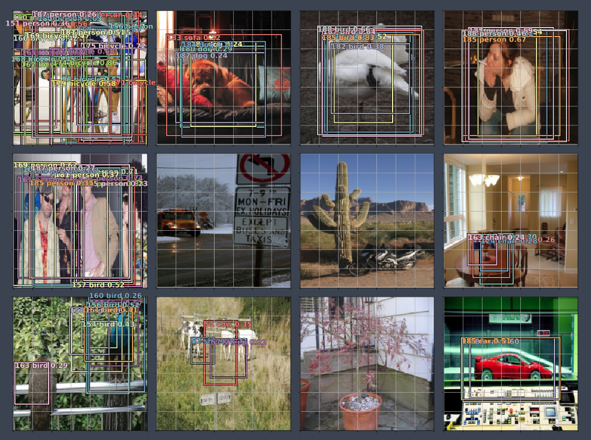

#### Focal Loss

:bookmark: Read the ["Focal Loss for Dense Object Detection"](https://arxiv.org/abs/1708.02002) paper.

The key thing is this very first picture.

The actual contribution of this paper is to add `(1 − pt)^γ` to the start of the equation [01:45:06] which sounds like nothing but actually people have been trying to figure out this problem for years. When you come across a paper like this which is game-changing, you shouldn't assume you are going to have to write thousands of lines of code. Very often it is one line of code, or the change of a single constant, or adding log to a single place.

##### Implementing Focal Loss

When we defined the binomial cross entropy loss, you may have noticed that there was a weight which by default was `None`:

```Python
class BCE_Loss(nn.Module):
    """
    Binomial Cross Entropy Loss.

    Each anchor box can only have one object associated with it. Its possible for an anchor box to have NOTHING in it.
    We could:

    1. treat background as a class - difficult, because its asking the NN to say 'does this square NOT have 20 other things'
    2. BCE loss, checks by process of elimination - if there's no 20 object detected, then its background (0 positives)
    """
    def __init__(self, num_classes):
        super().__init__()
        self.num_classes = num_classes

    def forward(self, pred, targ):
        # take the one hot embedding of the target (at this stage, we do have the idea of background)
        t = one_hot_embedding(targ, self.num_classes + 1)
        # remove the background column (the last one) which results in a vector either of all zeros or one one
        t = V(t[:, :-1].contiguous())#.cpu()
        x = pred[:, :-1]
        w = self.get_weight(x, t)
        # use binary cross-entropy predictions
        return F.binary_cross_entropy_with_logits(x, t, w, size_average=False) / self.num_classes

    def get_weight(self, x, t):
        return None
```

When you call `F.binary_cross_entropy_with_logits`, you can pass in the weight. Since we just wanted to multiply a cross entropy by something, we can just define `get_weight`.

Here is the entirety of focal loss:

```Python
class FocalLoss(BCE_Loss):
    def get_weight(self, x, t):
        alpha, gamma = 0.25, 2. # in the original code, the gamma value is 1. In paper is 2.0. Why?
        p = x.sigmoid()
        pt = p * t + (1 - p) * (1 - t)
        w = alpha * t + (1 - alpha) * (1 - t)
        return w * (1 - pt).pow(gamma)
```

If you were wondering why `alpha` and `gamma` are `0.25` and `2`, here is another excellent thing about this paper, because they tried lots of different values and found that these work well.

**Training**

```Python
loss_f = FocalLoss(len(id2cat))

...     ...     ...
...     ...     ...

learn.fit(lrs, 1, cycle_len=10, use_clr=(20, 10))

# -----------------------------------------------------------------------------
# Output
# -----------------------------------------------------------------------------
epoch      trn_loss   val_loss
    0      15.550314  21.57637
    1      16.648582  18.164512
    2      15.653142  14.748936
    3      14.288999  15.339103
    4      12.949968  12.573363
    5      11.752214  12.210602
    6      10.788599  11.682604
    7      10.097296  11.840508
    8      9.543635   11.384417
    9      9.004486   11.148148
[array([11.14815])]

learn.save('fl0')
learn.load('fl0')

learn.freeze_to(-2)
learn.fit(lrs / 4, 1, cycle_len=10, use_clr=(20, 10))
# -----------------------------------------------------------------------------
# Output
# -----------------------------------------------------------------------------
epoch      trn_loss   val_loss
    0      8.384461   11.417507
    1      8.436978   11.682564
    2      8.360014   11.665135
    3      8.155825   11.368144
    4      7.931341   11.36015
    5      7.63321    11.13176
    6      7.330255   11.283114
    7      7.063865   11.128076
    8      6.867503   11.084224
    9      6.725401   11.066812
[array([11.06681])]

learn.save('drop4')
learn.load('drop4')

plot_results(0.75)
```

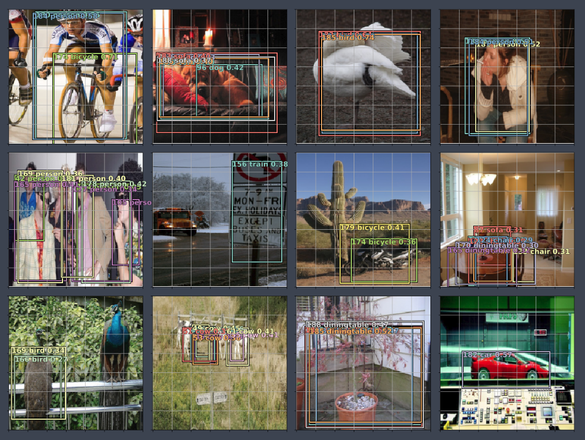

This time things are looking quite a bit better.

So our last step, for now, is to basically figure out how to pull out just the interesting ones.

#### Non Maximum Suppression (NMS)

All we are going to do is we are going to go through every pair of these bounding boxes and if they overlap by more than some amount, say 0.5, using Jaccard and they are both predicting the same class, we are going to assume they are the same thing and we are going to pick the one with higher `p` value.

```Python
def nms(boxes, scores, overlap=0.5, top_k=100):
    keep = scores.new(scores.size(0)).zero_().long()
    if boxes.numel() == 0:
        return keep
    x1 = boxes[:, 0]
    y1 = boxes[:, 1]
    x2 = boxes[:, 2]
    y2 = boxes[:, 3]
    area = torch.mul(x2 - x1, y2 - y1)
    v, idx = scores.sort(0)  # sort in ascending order
    idx = idx[-top_k:]  # indices of the top-k largest vals
    xx1 = boxes.new()
    yy1 = boxes.new()
    xx2 = boxes.new()
    yy2 = boxes.new()
    w = boxes.new()
    h = boxes.new()

    count = 0
    while idx.numel() > 0:
        i = idx[-1]  # index of current largest val
        keep[count] = i
        count += 1
        if idx.size(0) == 1:
            break
        idx = idx[:-1]  # remove kept element from view
        # load bboxes of next highest vals
        torch.index_select(x1, 0, idx, out=xx1)
        torch.index_select(y1, 0, idx, out=yy1)
        torch.index_select(x2, 0, idx, out=xx2)
        torch.index_select(y2, 0, idx, out=yy2)
        # store element-wise max with next highest score
        xx1 = torch.clamp(xx1, min=x1[i])
        yy1 = torch.clamp(yy1, min=y1[i])
        xx2 = torch.clamp(xx2, max=x2[i])
        yy2 = torch.clamp(yy2, max=y2[i])
        w.resize_as_(xx2)
        h.resize_as_(yy2)
        w = xx2 - xx1
        h = yy2 - yy1
        # check sizes of xx1 and xx2.. after each iteration
        w = torch.clamp(w, min=0.0)
        h = torch.clamp(h, min=0.0)
        inter = w * h
        # IoU = i / (area(a) + area(b) - i)
        rem_areas = torch.index_select(area, 0, idx)  # load remaining areas)
        union = (rem_areas - inter) + area[i]
        IoU = inter / union  # store result in iou
        # keep only elements with an IoU <= overlap
        idx = idx[IoU.le(overlap)]
    return keep, count

def show_nmf(idx):
    ima = md.val_ds.ds.denorm(x)[idx]
    bbox, clas = get_y(y[0][idx], y[1][idx])
    a_ic = actn_to_bb(b_bb[idx], anchors)
    clas_pr, clas_ids = b_clas[idx].max(1)
    clas_pr = clas_pr.sigmoid()

    conf_scores = b_clas[idx].sigmoid().t().data

    out1, out2, cc = [], [], []

    for cl in range(0, len(conf_scores) - 1):
        c_mask = conf_scores[cl] > 0.25
        if c_mask.sum() == 0:
            continue
        scores = conf_scores[cl][c_mask]
        l_mask = c_mask.unsqueeze(1).expand_as(a_ic)
        boxes = a_ic[l_mask].view(-1, 4)
        ids, count = nms(boxes.data, scores, 0.4, 50)
        ids = ids[:count]
        out1.append(scores[ids])
        out2.append(boxes.data[ids])
        cc.append([cl] * count)
    cc = T(np.concatenate(cc))
    out1 = torch.cat(out1)
    out2 = torch.cat(out2)

    fig, ax = plt.subplots(figsize=(8, 8))
    torch_gt(ax, ima, out2, cc, out1, 0.1)

for i in range(12):
    show_nmf(i)
```


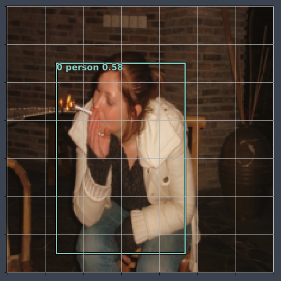

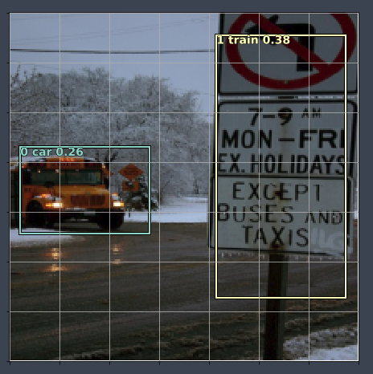

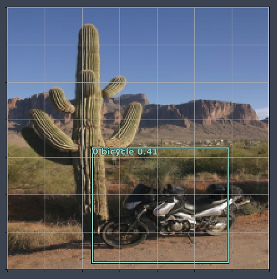

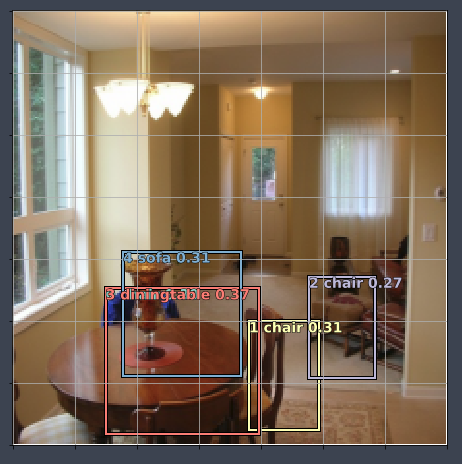


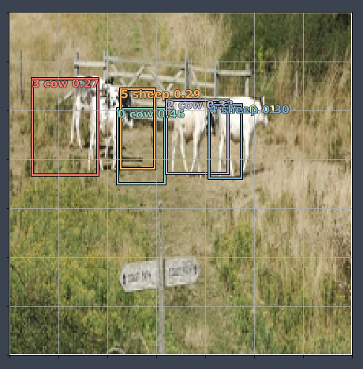

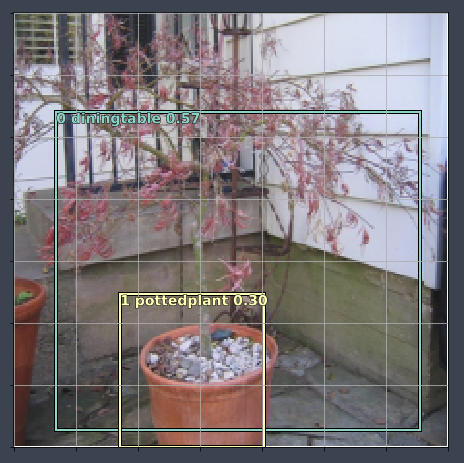

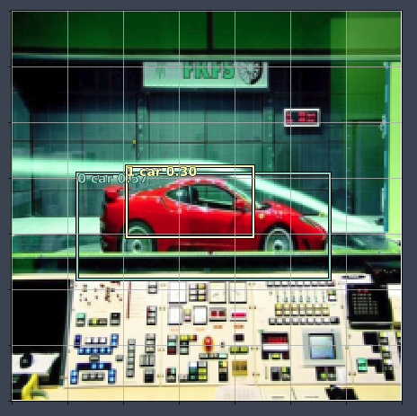

There are some things still to fix here. The trick will be to use something called **feature pyramid**. That is what we are going to do in lesson 14.

#### Talking a little more about SSD paper [01:54:03]

When this paper came out, Jeremy was excited because this and YOLO were the first kind of single-pass good quality object detection method that come along. There has been this continuous repetition of history in the deep learning world which is things that involve multiple passes of multiple different pieces, over time, particularly where they involve some non-deep learning pieces (like R-CNN did), over time, they always get turned into a single end-to-end deep learning model. So I tend to ignore them until that happens because that's the point where people have figured out how to show this as a deep learning model, as soon as they do that they generally end up something much faster and much more accurate. So SSD and YOLO were really important.

The model is 4 paragraphs. Papers are really concise which means you need to read them pretty carefully. Partly, though, you need to know which bits to read carefully. The bits where they say “here we are going to prove the error bounds on this model,” you could ignore that because you don't care about proving error bounds. But the bit which says here is what the model is, you need to read real carefully.

Jeremy reads a section **2.1 Model** [01:56:37]

If you jump straight in and read a paper like this, these 4 paragraphs would probably make no sense. But now that we've gone through it, you read those and hopefully thinking “oh that's just what Jeremy said, only they sad it better than Jeremy and less words [02:00:37]. If you start to read a paper and go “what the heck”, the trick is to then start reading back over the citations.

Jeremy reads **Matching strategy** and **Training objective** (a.k.a. Loss function)[02:01:44]

### Closing

This week, we go through the code and go through the paper and see what is going on. Remember what Jeremy did to make it easier for you was he took that loss function, he copied it into a cell and split it up so that each bit was in a separate cell. Then after every sell, he printed or plotted that value. Hopefully this is a good starting point.
