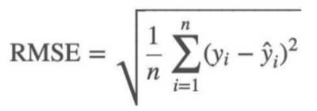
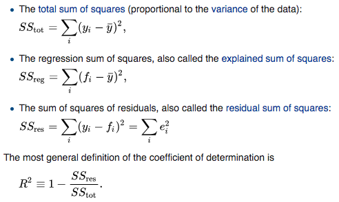
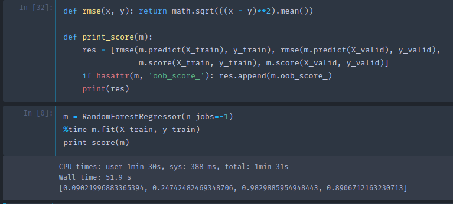
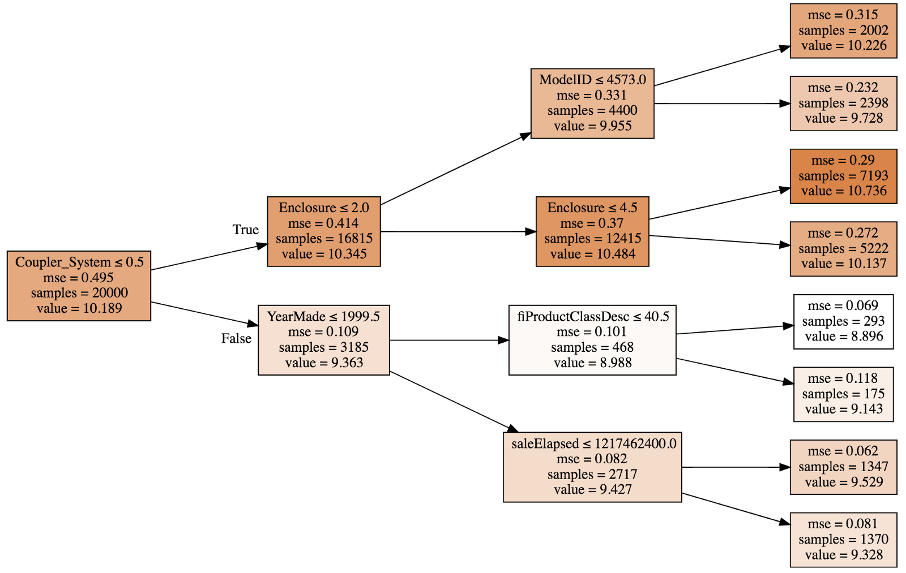
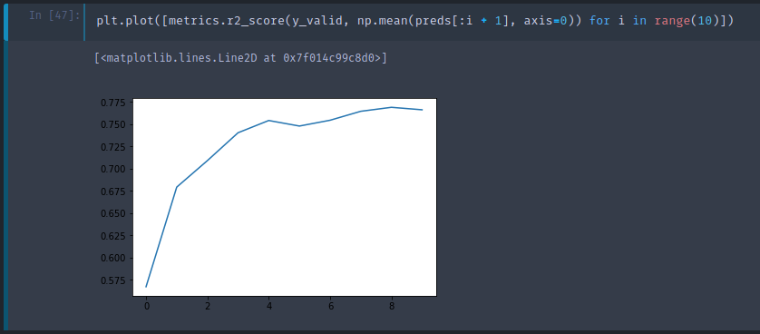
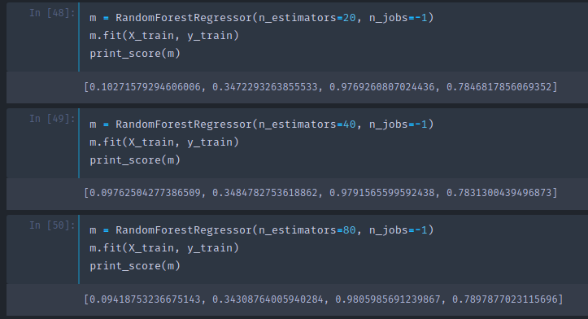
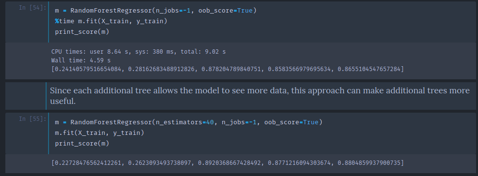
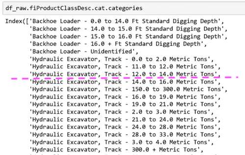

# Lesson 2 - Random Forest Deep Dive

_These are my personal notes from fast.ai machine learning course and will continue to be updated and improved if I find anything useful and relevant while I continue to review the course to study much more in-depth. Thanks for reading and happy learning!_

## Topics

* How random forests actually work
* Creating a good validation set
* Bagging of little bootstraps
* Ensembling
* Out-of-bag (OOB) score

## Lesson Resources

* [Video](https://youtu.be/blyXCk4sgEg)
* Jupyter Notebook and code
  * [lesson1-rf.ipynb](https://nbviewer.jupyter.org/github/fastai/fastai/blob/master/courses/ml1/lesson1-rf.ipynb)

## My Notes

For the next couple lessons, we will look at:

- how random forests actually work
- what to do if they do not work properly
- what the pros and cons are
- what we can tune
- how to interpret the result

Fastai library is a collections of best techniques to achieve state-of-the-art result. For structured data analysis, scikit-learn has a lot of great code. So what fastai does is to help us get things into scikit-learn and then interpret things out from scikit-learn.

As we noted, it is very important to deeply understand the evaluation metric [[00:06:00](https://youtu.be/blyXCk4sgEg?t=6m)].

Root Mean Squared Logarithmic Error (RMSLE):




So we took the log of the price and use root mean squared error (RMSE).

```python
df_raw.SalePrice = np.log(df_raw.SalePrice)
```

Then we made everything in the dataset to numbers by doing the following:

- `add_datepart `—extract date-time features `Elapsed` represents how many days are elapsed since January 1st, 1970.
- `train_cats`—converts `string` to pandas `category` data type. We then replace categorical columns with category codes by running `proc_df`.
- `proc_df` also replaces missing values of the continuous columns with the median and adds the column called `[column name]_na` and sets it to true to indicate it was missing.

```python
m = RandomForestRegressor(n_jobs=-1)
m.fit(df, y)
m.score(df, y)

# -----------------------------------------------------------------------------
# Output
# -----------------------------------------------------------------------------
0.98304680998313232
```

### What is R² [[00:10:50](https://youtu.be/blyXCk4sgEg?t=10m50s)]?

Jeremy's answer [[00:11:47](https://youtu.be/blyXCk4sgEg?t=11m47s)]

[](https://en.wikipedia.org/wiki/Coefficient_of_determination)

- *yi* : actual/target data
- *ȳ* : the average (mean)
- `SStot`: how much the data vary
- The simplest non-stupid model we came up with last week was create a column of the mean and submit that to Kaggle. In that case, RMSE = `SStot` (i.e. RMSE of a naïve model)
- *fi*: predictions
- `SSres` is RMSE of the actual model
- If we were exactly as effective as just predicting the mean, `SSres/SStot` = 1 and R² = 0
- If we were perfect (i.e. yi = fi for all cases), `SSres/SStot` = 0 and R² = 1

### What is the possible range of R² [[00:14:43](https://youtu.be/blyXCk4sgEg?t=14m43s)]?

Correct answer: Anything equal to or less than 1. If you predicted infinity for every row, R² = 1 − ∞

So when your R² is negative, it means your model is worse than predicting the mean.

R² is not necessarily what you are actually trying to optimize, but it is a number you can use for every model and you can start to get a feel of what .8 looks like or what .9 looks like. Something you may find interesting is to create synthetic 2D datasets with different amounts of random noise, and see what they look like on a scatterplot and their R² to get a feel of how close they are to the actual value.

R² is the ratio between how good your model is (RMSE)vs. how good is the naïve mean model (RMSE).

### Overfitting [[00:17:33](https://youtu.be/blyXCk4sgEg?t=17m33s)]

In our case, R²= 0.98 is a very good model. However, it might be the case that it looks like the one on the right:


It is good at running through points we gave it, but it is not going to be very good at running through points we didn't give it. That is why we always want to have a validation set.

Creating a validation set is the most important thing you need to do when you are doing a machine learning project. What you need to do is to come up with a dataset where the score of your model on that dataset is going to be representative of how well your model is going to do in the real world.

If your dataset has a time piece in it (as is in Blue Book competition), you would likely want to predict future prices/values/etc. What Kaggle did was to give us data representing a particular date range in the training set, and then the test set presented a future set of dates that wasn't represented in the training set. So we need to create a validation set that has the same properties:

```python
def split_vals(a,n): return a[:n].copy(), a[n:].copy()
n_valid = 12000  # same as Kaggle's test set size
n_trn = len(df)-n_valid
raw_train, raw_valid = split_vals(df_raw, n_trn)
X_train, X_valid = split_vals(df, n_trn)
y_train, y_valid = split_vals(y, n_trn)
X_train.shape, y_train.shape, X_valid.shape

# -----------------------------------------------------------------------------
# Output
# -----------------------------------------------------------------------------
((389125, 66), (389125,), (12000, 66))
```

We now have something which hopefully looks like Kaggle test set — close enough that using this would give us reasonably accurate scores. The reason we want this is because on Kaggle, you can only submit so many times and if you submit too often, you will end up fitting to the leaderboard anyway. In real life, we want to build a model that is going to work well in the production.

:question: Could you explain the difference between a validation set and a test set [[00:20:58](https://youtu.be/blyXCk4sgEg?t=20m58s)]?

One of the things we are going to learn today is how to set hyper parameters. Hyper parameters are tuning parameters that are going to change how your model behaves. If you just have one holdout set (i.e. one set of data that you are not using to train with) and we use that to decide which set of hyper parameter to use. If we try a thousand different sets of hyper parameters, we may end up overfitting to that holdout set. So what we want to do is to have a second holdout set (the test set) where we can say I have done the best I can and now just once right at the end, I am going to see whether it works.

You must actually remove the second holdout set (test set) from the data, give it to somebody else, and tell them not let you look at it until you promise you are finished. Otherwise it is so hard not to look at it. In the world of psychology and sociology, it is known as replication crisis or P-hacking. That is why we want to have a test set.

:question: We have converted categorical variable into numbers but other models convert it to different columns using one hot encoding — which approach should we use [[00:22:55](https://youtu.be/blyXCk4sgEg?t=22m55s)]?

We are going to tackle that today.

### Base model [[00:23:42](https://youtu.be/blyXCk4sgEg?t=23m42s)]



As you see, R² is .982 on the training set, and only .887 on the validation set which makes us think that we are overfitting quite badly. But not too badly as RMSE of 0.25 would have put us in the top 25% of the competition.

:question: Why not choose random set of rows as a validation set[[00:24:19](https://youtu.be/blyXCk4sgEg?t=24m19s)]?

Because if we did that, we would not be replicating the test set. If you actually look at the dates in the test set, they are a set of dates that are more recent than any date in the training set. So if we used a validation set that was a random sample, that is much easier because we are predicting the value of a piece of industrial equipment on this day when we already have some observations from that day. In general, anytime you are building a model that has a time element, you want your test set to be a separate time period and therefore you really need your validation set to be of separate time period as well.

:question: Wouldn't it eventually overfit to the validation set? [[00:25:30](https://youtu.be/blyXCk4sgEg?t=25m30s)]

Yes, actually that is the issue. That would eventually have the possibility of overfitting on the validation set and when you try it on the test set or submit it to Kaggle, it turns out not to be very good. This happens in Kaggle competitions all the time and they actually have a fourth dataset which is called the private leader board set. Every time you submit to Kaggle, you actually only get feedback on how well it does on the public leader board set and you do not know which rows they are. At the end of the competition, you get judged on a different dataset entirely called the private leader board set. The only way to avoid this is to actually be a good machine learning practitioner and know how to set these parameters as effectively as possible which we are going to be doing partly today and over the next few weeks.

### PEP8 [[00:27:09](https://youtu.be/blyXCk4sgEg?t=27m9s)]

```python
def rmse(x,y): return math.sqrt(((x-y)**2).mean())
```

This is one of these examples where the code does not follow PEP8. Being able to look at something in one go with your eyes and over time learn to immediately see what is going on has a lot of values. Also consistently use particular letters or abbreviation to mean particular things works well in data science. But if you are doing take-home interview test, follow PEP8 standard.

### Execution Time [[00:29:29](https://youtu.be/blyXCk4sgEg?t=29m29s)]

If you put `%time`, it will tell you how long things took. The rule of thumb is that if something takes more than 10 seconds to run, it is too long to do interactive analysis with it. So what we do is we try to make sure that things can run in a reasonable time. And then when we are finished at the end of the day, we can say ok, this feature engineering, these hyper parameters, etc are all working well, and we will now re-run it the big slow precise way.

One way to speed things up is to pass in the subset parameter to proc_df which will randomly sample the data:

```python
df_trn, y_trn, nas = proc_df(df_raw, 'SalePrice', subset=30000, na_dict=nas)
X_train, _ = split_vals(df_trn, 20000)
y_train, _ = split_vals(y_trn, 20000)
```

- Be careful to make sure that validation set does not change
- Also make sure that training set does not overlap with the dates

As you see above, when calling `split_vals`, we do not put the result to a validation set. `_` indicates that we are throwing away the return value. We want to keep validation set the same all the time.

After resampling the training set into the first 20,000 out of a 30,000 subsets, it runs in 621 milliseconds.

### Building a single tree [[00:31:50](https://youtu.be/blyXCk4sgEg?t=31m50s)]

We are going to build a forest made of trees. Let's start by looking at trees. In scikit-learn, they do not call them trees but **estimators**.

```python
m = RandomForestRegressor(n_estimators=1, max_depth=3,
                          bootstrap=False, n_jobs=-1)
m.fit(X_train, y_train)
print_score(m)
```

- `n_estimators=1`—create a forest with just one tree
- `max_depth=3`—to make it a small tree
- `bootstrap=False`—random forest randomizes bunch of things, we want to turn that off by this parameter

This small deterministic tree has R² of 0.4028 after fitting so this is not a good model but better than the mean model since it is greater than 1 and we can actually draw [[00:33:00](https://youtu.be/blyXCk4sgEg?t=33m)]:



A tree consists of a sequence of binary decisions.

- The first line indicates the binary split criteria.
- `samples` at the root is 20,000 since that is what we specified when splitting the data.
- Darker color indicates higher `value` .
- `value` is average of the log of price, and if we built a model where we just used the average all the time, then the mean squared error `mse` would be 0.495.
- The best single binary split we can make turns out to be `Coupler_system ≤ 0.5` which will improve `mse` to 0.109 in false path; 0.414 in true path.

We want to start building a random forest from scratch [[00:36:28](https://youtu.be/blyXCk4sgEg?t=36m28s)]. The first step is to create a tree. The first step to create a tree is to create the first binary decision. How are you going to do it?

- We need to pick a variable and the value to split on such that the two groups are as different to each other as possible.
- For each variable, for each possible value of the possible value of that variable see whether it is better.
- How to determine if it is better? Take weighted average of two new nodes.
- The resulting model will be similar to the naïve model of means — we have a model with a single binary decision. For everybody with coupler_system greater than 0.5, we will fill in 10.345, for everybody else, we will put 9.363. Then we will calculate RMSE of this model.

We now have a single number that represents how good a split is which is the weighted average of the mean squared errors of the two groups that creates [[00:42:13](https://youtu.be/blyXCk4sgEg?t=42m13s)]. We also have a way to find the best split which is to try try every variable and to try every possible value of that variable and see which variable and which value gives us a split with the best score.

:question: Are there circumstances when it is better to split into 3 groups [[00:45:12](https://youtu.be/blyXCk4sgEg?t=45m12s)]?

It is never necessary to do more than one split at a level because you can just split them again.

This is the entirety of creating a decision tree. Stopping condition:

- When you hit the limit that was requested (`max_depth`)
- When your leaf nodes only have one thing in them

### Let's make our decision tree better [[00:46:10](https://youtu.be/blyXCk4sgEg?t=46m10s)]

Right now, our decision tree has R² of 0.4. Let's make it better by removing `max_depth=3`. By doing so, the training R² becomes 1 (as expected since each leaf node contains exactly one element) and validation R² is 0.73 — which is better than the shallow tree but not as good as we would like.

```python
m = RandomForestRegressor(n_estimators=1, bootstrap=False,
                          n_jobs=-1)
m.fit(X_train, y_train)
print_score(m)

# -----------------------------------------------------------------------------
# Output
# -----------------------------------------------------------------------------
[6.5267517864504e-17, 0.3847365289469930, 1.0, 0.73565273648797624]
```

To make these trees better, we will create a forest. To create a forest, we will use a statistical technique called **bagging**.

### Bagging [[00:47:12](https://youtu.be/blyXCk4sgEg?t=47m12s)]

Michael Jordan developed a technique called the **[Bag of Little Bootstraps](https://people.eecs.berkeley.edu/~jordan/papers/blb_icml2012.pdf)** in which he shows how to use bagging for absolutely any kind of model to make it more robust and also to give you confidence intervals.

Random forest—a way of bagging trees.

So what is bagging? Bagging is an interesting idea which is what if we created five different models each of which was only somewhat predictive but the models gave predictions that were not correlated with each other. That would mean that the five models would have profound different insights into the relationships in the data. If you took the average of those five models, you are effectively bringing in the insights from each of them. So this idea of averaging models is a technique for **Ensembling**.

What if we created a whole a lot of trees — big, deep, massively overfit trees but each one, let's say, we only pick a random 1/10 of the data. Let's say we do that a hundred times (different random sample every time). They are overfitting terribly but since they are all using different random samples, they all overfit in different ways on different things. In other words, they all have errors but the errors are random. The average of a bunch of random errors is zero. If we take the average of these trees each of which have been trained on a different random subset, the error will average out to zero and what is left is the true relationship — and that's the random forest.

```python
m = RandomForestRegressor(n_jobs=-1)
m.fit(X_train, y_train)
print_score(m)
```

`n_estimators` by default is 10 (remember, estimators are trees).

:question: Are you saying we average 10 crappy models and we get a good model? [[00:51:25](https://youtu.be/blyXCk4sgEg?t=51m25s)]

Exactly. Because the crappy models are based on different random subsets and their errors are not correlated with each other. If the errors were correlated, this will not work.

> The key insight here is to construct multiple models which are better than nothing and where the errors are, as much as possible, not correlated with each other.

The number of trees to use is the first of our **hyper parameters** we are going to tune to achieve higher metric.

:question: The subset you are selecting, are they exclusive? Can there be overlaps? [[00:52:27](https://youtu.be/blyXCk4sgEg?t=52m27s)]

We talked about picking 1/10 at random, but what scikit-learn does by default is for n rows, it picks out n rows with replacement — which is called bootstrapping. If memory serves correctly, on average, 63.2% of the rows will be represented and many of them will be appear multiple times.

The entire purpose of modeling in machine learning is to find a model which tells you which variables are important and how do they interact together to drive your dependent variable. In practice, the difference between using the random forest space to find your nearest neighbors vs. Euclidean space is the difference between a model that makes good predictions and the model that makes meaningless predictions.

The effective machine learning model is accurate at finding the relationships in the training data and generalizes well to new data [[00:55:53](https://youtu.be/blyXCk4sgEg?t=55m53s)]. In bagging, that means that each of your individual estimators, you want them to be as predictive as possible but for the predictions of your individual trees to be as uncorrelated as possible. The research community found that the more important thing seems to be creating uncorrelated trees rather than more accurate trees. In scikit-learn, there is another class called `ExtraTreeClassifier` which is an extremely randomized tree model. Rather than trying every split of every variable, it randomly tries a few splits of a few variables which makes training much faster and it can build more trees — better generalization. If you have crappy individual models, you just need more trees to get a good end model.

### Coming up with predictions [[01:04:30](https://youtu.be/blyXCk4sgEg?t=1h4m30s)]

```python
preds = np.stack([t.predict(X_valid) for t in m.estimators_])
preds[:,0], np.mean(preds[:,0]), y_valid[0]

# -----------------------------------------------------------------------------
# Output
# -----------------------------------------------------------------------------
(array([ 9.21034,  8.9872 ,  8.9872 ,  8.9872 ,  8.9872 ,  9.21034,  8.92266,  9.21034,  9.21034,  8.9872 ]),
9.0700003890739005,
9.1049798563183568)

preds.shape

# -----------------------------------------------------------------------------
# Output
# -----------------------------------------------------------------------------
(10, 12000)
```

Each tree is stored in an attribute called `estimators_` . For each tree, we will call `predict` with our validation set. `np.stack` concatenates them together on a new axis, so the resulting `preds` has the shape of `(10, 12000)` (10 trees, 12000 validation set). The mean of 10 predictions for the first data is 9.07, and the actual value is 9.10. As you can see, none of the individual prediction is close to 9.10, but the mean ends up pretty good.



Here is a plot of R² values given first i trees. As we add more trees, R² improves. But it seems as though it has flattened out.



As you see, adding more trees do not help much. It will not get worse but it will stop improving things much. This is the first hyper parameter to learn to set — a number of estimators. A method of setting is, as many as you have time to fit and that actually seems to be helping.

Adding more trees slows it down, but with less trees you can still get the same insights. So when Jeremy builds most of his models, he starts with 20 or 30 trees and at the end of the project or at the end of the day's work, he will use 1000 trees and run it over night.

### Out-of-bag (OOB) score [[01:10:04](https://youtu.be/blyXCk4sgEg?t=1h10m4s)]

Sometimes your dataset will be small and you will not want to pull out a validation set because doing so means you now do not have enough data to build a good model. However, random forests have a very clever trick called *out-of-bag (OOB)* error which can handle this (and more!)

What we could do is to recognize that in our first tree, some of the rows did not get used for training. What we could do is to pass those unused rows through the first tree and treat it as a validation set. For the second tree, we could pass through the rows that were not used for the second tree, and so on. Effectively, we would have a different validation set for each tree. To calculate our prediction, we would average all the trees where that row is not used for training. If you have hundreds of trees, it is very likely that all of the rows are going to appear many times in these out-of-bag samples. You can then calculate RMSE, R², etc on these out-of-bag predictions.

```python
m = RandomForestRegressor(n_estimators=40, n_jobs=-1,
                          oob_score=True)
m.fit(X_train, y_train)
print_score(m)

# -----------------------------------------------------------------------------
# Output
# -----------------------------------------------------------------------------
[0.10198464613020647, 0.2714485881623037, 0.9786192457999483, 0.86840992079038759, 0.84831537630038534]
```

Setting `oob_score` to true will do exactly this and create an attribute called `oob_score_` to the model and as you see in the print_score function, if it has this attributes, it will print it out at the end.

:question: Wouldn't `oob_score_` always lower than the one for the entire forest [[01:12:51](https://youtu.be/blyXCk4sgEg?t=1h12m51s)]?

The accuracy tends to be lower because each row appears in less trees in the OOB samples than it does in the full set of trees. So OOB R² will slightly underestimate how generalizable the model is, but the more trees you add, the less serious that underestimation is.

OOB score will come in handy when setting hyper parameters [[01:13:47](https://youtu.be/blyXCk4sgEg?t=1h13m47s)]. There will be quite a few hyper parameters that we are going to set and we would like to find some automated say to set them. One way to do that is to do **grid search**. Scikit-learn has a function called grid search and you pass in a list of all the hyper parameters you want to tune and all of the values of these hyper parameters you want to try. It will run your model on every possible combination of all these hyper parameters and tell you which one is the best. OOB score is a great choice for getting it to tell you which one is the best.

### Subsampling [[01:14:52](https://youtu.be/blyXCk4sgEg?t=1h14m52s)]

Earlier, we took 30,000 rows and created all the models which used a different subset of that 30,000 rows. Why not take a totally different subset of 30,000 each time? In other words, let's leave the entire 389,125 records as is, and if we want to make things faster, pick a different subset of 30,000 each time. So rather than bootstrapping the entire set of rows, just randomly sample a subset of the data.

```python
df_trn, y_trn = proc_df(df_raw, 'SalePrice')
X_train, X_valid = split_vals(df_trn, n_trn)
y_train, y_valid = split_vals(y_trn, n_trn)
set_rf_samples(20000)
```

`set_rf_samples` : Just as before, we use 20,000 of them in our training set (before it was out of 30,000, this time it is out of 389,125).



This will take the same amount of time to run as before, but every tree has an access to the entire dataset. After using 40 estimators, we get the R² score of 0.876.

:question: What samples is this OOB score calculated on [[01:18:26](https://youtu.be/blyXCk4sgEg?t=1h18m26s)]?

Scikit-learn does not support this out of box, so `set_rf_samples` is a custom function. So OOB score needs to be turned off when using `set_rf_samples` as they are not compatible. `reset_rf_samples()` will turn it back to the way it was.

**The biggest tip** [[01:20:30](https://youtu.be/blyXCk4sgEg?t=1h20m30s)]: Most people run all of their models on all of the data all of the time using their best possible parameters which is just pointless. If you are trying to find out which feature is important and how they are related to each other, having that 4th decimal place of accuracy is not going to change any of your insights at all. Do most of your models on a large enough sample size that your accuracy is reasonable (within a reasonable distance of the best accuracy you can get) and taking a small number of seconds to train so that you can interactively do your analysis.

### A couple more parameters [[01:21:18](https://youtu.be/blyXCk4sgEg?t=1h21m18s)]

Let's get a baseline for this full set to compare to:

```python
reset_rf_samples()
m = RandomForestRegressor(n_estimators=40, n_jobs=-1,
                          oob_score=True)
m.fit(X_train, y_train)
print_score(m)

# -----------------------------------------------------------------------------
# Output
# -----------------------------------------------------------------------------
[0.07843013746508616, 0.23879806957665775, 0.98490742269867626, 0.89816206196980131, 0.90838819297302553]
```

Here OOB is higher than validation set. This is because our validation set is a different time period whereas OOB samples are random. It is much harder to predict a different time period.

### `min_sample`

```python
m = RandomForestRegressor(n_estimators=40, min_samples_leaf=3,
                          n_jobs=-1, oob_score=True)
m.fit(X_train, y_train)
print_score(m)

# -----------------------------------------------------------------------------
# Output
# -----------------------------------------------------------------------------
[0.11595869956476182, 0.23427349924625201, 0.97209195463880227, 0.90198460308551043, 0.90843297242839738]
```

- `min_sample_leaf=3` : Stop training the tree further when a leaf node has 3 or less samples (before we were going all the way down to 1). This means there will be one or two less levels of decision being made which means there are half the number of actual decision criteria we have to train (i.e. faster training time).
- For each tree, rather than just taking one point, we are taking the average of at least three points that we would expect the each tree to generalize better. But each tree is going to be slightly less powerful on its own.
- The numbers that work well are 1, 3, 5, 10, 25, but it is relative to your overall dataset size.
- By using 3 instead of 1, validation R² improved from 0.89 to 0.90

### `max_feature` [[01:24:07](https://youtu.be/blyXCk4sgEg?t=1h24m7s)]

```python
m = RandomForestRegressor(n_estimators=40, min_samples_leaf=3,
                      max_features=0.5, n_jobs=-1, oob_score=True) m.fit(X_train, y_train)
print_score(m)

# -----------------------------------------------------------------------------
# Output
# -----------------------------------------------------------------------------
[0.11926975747908228, 0.22869111042050522, 0.97026995966445684, 0.9066000722129437, 0.91144914977164715]
```

- `max_features=0.5` : The idea is that the less correlated your trees are with each other, the better. Imagine you had one column that was so much better than all of the other columns of being predictive that every single tree you built always started with that column. But there might be some interaction of variables where that interaction is more important than the individual column. So if every tree always splits on the same thing the first time, you will not get much variation in those trees.
- In addition to taking a subset of rows, at every single split point, take a different subset of columns.
- For row sampling, each new tree is based on a random set of rows, for column sampling, every individual binary split, we choose from a different subset of columns.
- 0.5 means randomly choose a half of them. There are special values you can use such as `sqrt` or `log2`
- Good values to use are `1`, `0.5`, `log2`, or `sqrt`

The RMSLE of 0.2286 would get us to the top 20 of this competition — with brainless random forest with some brainless minor hyper parameter tuning. This is why Random Forest is such an important not just first step but often only step of machine learning. It is hard to screw up.

### Why Random Forest works so well [[01:30:21](https://youtu.be/blyXCk4sgEg?t=1h30m21s)]

Let's take a look at one of the split point in the small single tree.

`fiProductClassDesc ≤ 7.5` will split:



Why does this even work? Imagine the only thing that mattered was `Hydraulic Excavator, Track − 0.0 to 2.0 Metric Tons` and nothing else mattered. It can pick out a single element by first splitting `fiProductClassDesc ≤ 5.5 then fiProductClassDesc > 4.5` . With just two splits, we can pull out a single category. Tree is infinitely flexible even with a categorical variable. If there is a particular category which has different level of price, it can gradually zoom in on those group by using multiple splits. Random forest is very easy to use and very resilient.

Next lesson, we will learn about how to analyze the model to learn more about the data to make it even better.
